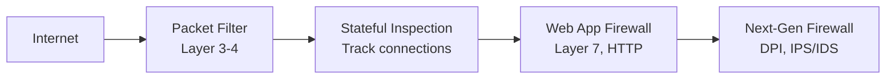

# Firewall & Network Security

Firewall adalah garis pertahanan pertama jaringan — mengontrol traffic yang masuk dan keluar.

## Jenis Firewall



## iptables — Linux Firewall

```bash
# Lihat rules
iptables -L -n -v

# Policy default: DROP semua
iptables -P INPUT DROP
iptables -P FORWARD DROP
iptables -P OUTPUT ACCEPT

# Allow established connections
iptables -A INPUT -m state --state ESTABLISHED,RELATED -j ACCEPT

# Allow loopback
iptables -A INPUT -i lo -j ACCEPT

# Allow SSH (port 22)
iptables -A INPUT -p tcp --dport 22 -j ACCEPT

# Allow HTTP/HTTPS
iptables -A INPUT -p tcp -m multiport --dports 80,443 -j ACCEPT

# Rate limiting — cegah brute force
iptables -A INPUT -p tcp --dport 22 -m recent --set --name SSH
iptables -A INPUT -p tcp --dport 22 -m recent --update --seconds 60 --hitcount 4 --name SSH -j DROP

# Simpan rules
iptables-save > /etc/iptables/rules.v4
```

## UFW — Simplified Firewall

```bash
ufw default deny incoming
ufw default allow outgoing

ufw allow ssh
ufw allow 80/tcp
ufw allow 443/tcp
ufw deny 3306  # Block MySQL dari luar

# Rate limiting
ufw limit ssh

ufw enable
ufw status verbose
```

## Fail2ban — Blokir Brute Force

```bash
apt install fail2ban

# /etc/fail2ban/jail.local
[sshd]
enabled = true
port = ssh
maxretry = 3
bantime = 3600  # 1 jam
findtime = 600  # dalam 10 menit

[nginx-http-auth]
enabled = true
maxretry = 5

systemctl restart fail2ban
fail2ban-client status sshd
```

## VPN dengan WireGuard

```bash
# Install
apt install wireguard

# Generate keys
wg genkey | tee server_private.key | wg pubkey > server_public.key
wg genkey | tee client_private.key | wg pubkey > client_public.key

# /etc/wireguard/wg0.conf (server)
[Interface]
Address = 10.0.0.1/24
ListenPort = 51820
PrivateKey = <server_private_key>
PostUp = iptables -A FORWARD -i wg0 -j ACCEPT; iptables -t nat -A POSTROUTING -o eth0 -j MASQUERADE
PostDown = iptables -D FORWARD -i wg0 -j ACCEPT; iptables -t nat -D POSTROUTING -o eth0 -j MASQUERADE

[Peer]
PublicKey = <client_public_key>
AllowedIPs = 10.0.0.2/32

# Start
wg-quick up wg0
systemctl enable wg-quick@wg0
```

## Latihan

1. Setup firewall di VPS dengan UFW
2. Install fail2ban dan konfigurasi untuk SSH
3. Setup WireGuard VPN antara dua server
4. Scan firewall dengan nmap dari luar: `nmap -sV server_ip`
