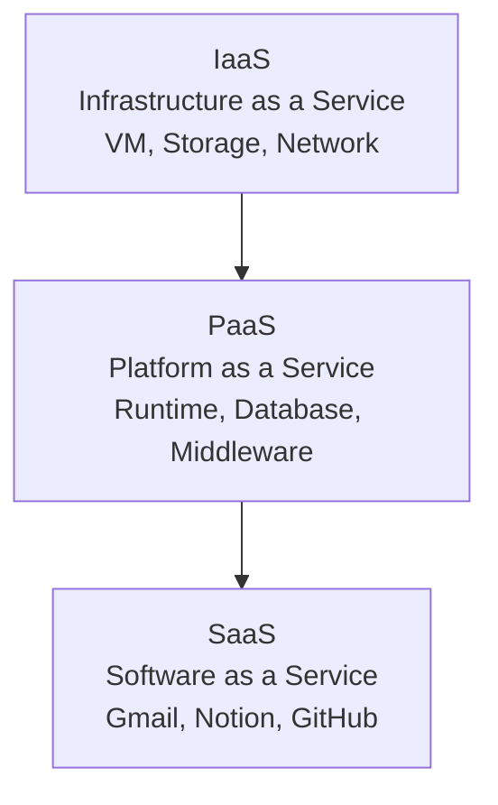

# Cloud Computing & VPS

Cloud computing menyediakan infrastruktur IT on-demand — bayar sesuai pakai, scale sesuai kebutuhan.

## Model Layanan Cloud



| Model | Kamu kelola | Provider kelola | Contoh |
|-------|-------------|-----------------|--------|
| IaaS | OS, Runtime, App | Hardware, Network | AWS EC2, DigitalOcean |
| PaaS | App, Data | Semua infrastruktur | Heroku, Railway, Vercel |
| SaaS | Tidak ada | Semua | Gmail, Figma |

## Setup VPS dengan Nginx

```bash
# 1. Update sistem
apt update && apt upgrade -y

# 2. Install Nginx
apt install nginx -y
systemctl enable nginx
systemctl start nginx

# 3. Konfigurasi virtual host
cat > /etc/nginx/sites-available/myapp << 'EOF'
server {
    listen 80;
    server_name lab.smauiiyk.sch.id;

    location / {
        proxy_pass http://localhost:3000;
        proxy_http_version 1.1;
        proxy_set_header Upgrade $http_upgrade;
        proxy_set_header Connection 'upgrade';
        proxy_set_header Host $host;
        proxy_cache_bypass $http_upgrade;
    }
}
EOF

ln -s /etc/nginx/sites-available/myapp /etc/nginx/sites-enabled/
nginx -t && systemctl reload nginx
```

## HTTPS dengan Let's Encrypt

```bash
apt install certbot python3-certbot-nginx -y
certbot --nginx -d lab.smauiiyk.sch.id
# Auto-renew sudah dikonfigurasi oleh certbot
```

## Docker — Containerisasi

```dockerfile
# Dockerfile
FROM node:22-alpine

WORKDIR /app
COPY package*.json ./
RUN npm ci --only=production

COPY . .
RUN npm run build

EXPOSE 3000
CMD ["node", "dist/server/entry.mjs"]
```

```bash
# Build image
docker build -t smauii-lab:latest .

# Run container
docker run -d \
  --name smauii-lab \
  -p 3000:3000 \
  --env-file .env \
  --restart unless-stopped \
  smauii-lab:latest

# Logs
docker logs -f smauii-lab
```

## Docker Compose

```yaml
# docker-compose.yml
version: "3.8"
services:
  app:
    build: .
    ports:
      - "3000:3000"
    env_file: .env
    restart: unless-stopped
    depends_on:
      - redis

  redis:
    image: redis:alpine
    restart: unless-stopped

  nginx:
    image: nginx:alpine
    ports:
      - "80:80"
      - "443:443"
    volumes:
      - ./nginx.conf:/etc/nginx/nginx.conf
      - /etc/letsencrypt:/etc/letsencrypt
    depends_on:
      - app
```

```bash
docker compose up -d
docker compose logs -f
docker compose down
```

## Cloudflare — CDN & Security

```bash
# Cloudflare Workers — serverless di edge
npm create cloudflare@latest my-worker

# wrangler.toml
name = "smauii-api"
main = "src/index.ts"
compatibility_date = "2026-04-17"

[[kv_namespaces]]
binding = "CACHE"
id = "xxx"
```

## Latihan

1. Setup VPS gratis di Oracle Cloud atau AWS Free Tier
2. Deploy aplikasi Node.js dengan Nginx reverse proxy
3. Setup HTTPS dengan Let's Encrypt
4. Containerize dengan Docker
5. Setup auto-deploy dari GitHub Actions
