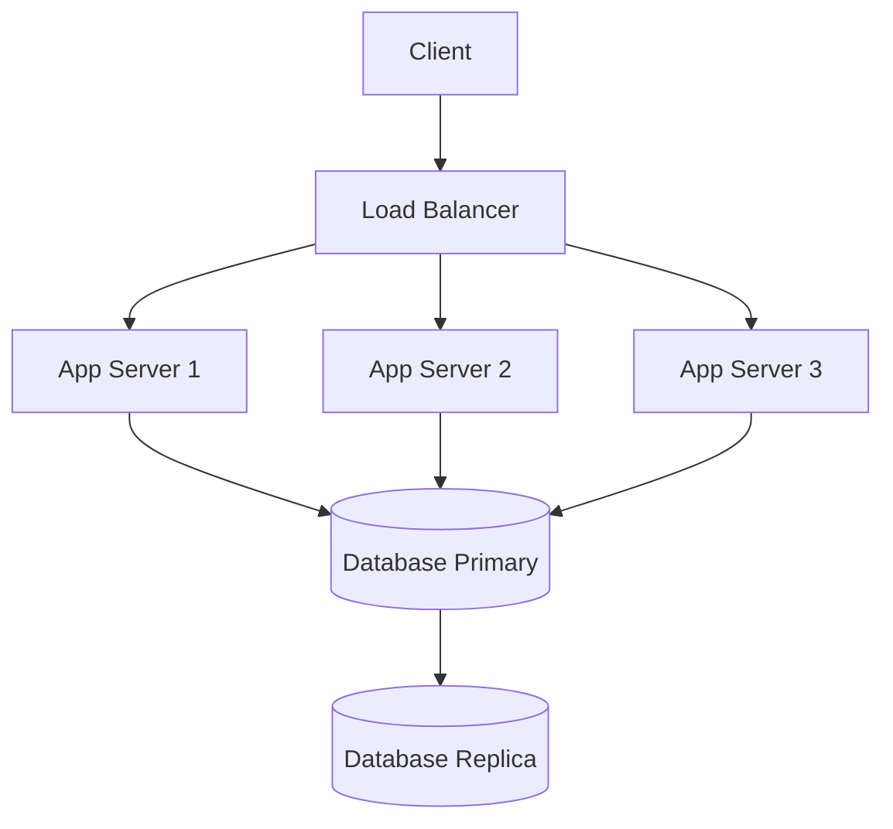

# Load Balancing & High Availability

Load balancer mendistribusikan traffic ke beberapa server — meningkatkan kapasitas dan reliabilitas.

## Arsitektur High Availability



## Nginx Load Balancer

```nginx
# /etc/nginx/conf.d/load-balancer.conf

upstream backend {
    # Round-robin (default)
    server 10.0.0.1:3000;
    server 10.0.0.2:3000;
    server 10.0.0.3:3000;

    # Weighted
    # server 10.0.0.1:3000 weight=3;
    # server 10.0.0.2:3000 weight=1;

    # Least connections
    # least_conn;

    # IP hash (sticky sessions)
    # ip_hash;

    # Health check
    server 10.0.0.1:3000 max_fails=3 fail_timeout=30s;
}

server {
    listen 80;
    server_name lab.smauiiyk.sch.id;

    location / {
        proxy_pass http://backend;
        proxy_set_header Host $host;
        proxy_set_header X-Real-IP $remote_addr;
        proxy_set_header X-Forwarded-For $proxy_add_x_forwarded_for;

        # Timeout settings
        proxy_connect_timeout 10s;
        proxy_read_timeout 30s;
    }

    # Health check endpoint
    location /health {
        access_log off;
        return 200 "OK\n";
    }
}
```

## HAProxy — Advanced Load Balancing

```
# /etc/haproxy/haproxy.cfg
global
    log /dev/log local0
    maxconn 50000

defaults
    mode http
    timeout connect 5s
    timeout client 30s
    timeout server 30s
    option httplog

frontend http_front
    bind *:80
    default_backend http_back

backend http_back
    balance roundrobin
    option httpchk GET /health
    server app1 10.0.0.1:3000 check
    server app2 10.0.0.2:3000 check
    server app3 10.0.0.3:3000 check backup

# Stats page
listen stats
    bind *:8404
    stats enable
    stats uri /stats
    stats refresh 10s
```

## Keepalived — Virtual IP Failover

```bash
# Master node: /etc/keepalived/keepalived.conf
vrrp_instance VI_1 {
    state MASTER
    interface eth0
    virtual_router_id 51
    priority 100
    advert_int 1

    authentication {
        auth_type PASS
        auth_pass secret123
    }

    virtual_ipaddress {
        192.168.1.100/24  # Virtual IP (berpindah ke backup jika master down)
    }
}

# Backup node: ganti state ke BACKUP, priority ke 90
```

## Database Replication

```sql
-- PostgreSQL Streaming Replication
-- Di primary: postgresql.conf
wal_level = replica
max_wal_senders = 3
hot_standby = on

-- Buat user replication
CREATE USER replicator REPLICATION LOGIN PASSWORD 'secret';

-- Di replica:
-- pg_basebackup -h primary_ip -U replicator -D /var/lib/postgresql/data
```

## Latihan

1. Setup 3 app server dengan Docker
2. Konfigurasi Nginx sebagai load balancer
3. Test failover: matikan 1 server, pastikan traffic dialihkan
4. Monitor dengan Grafana: requests per server
