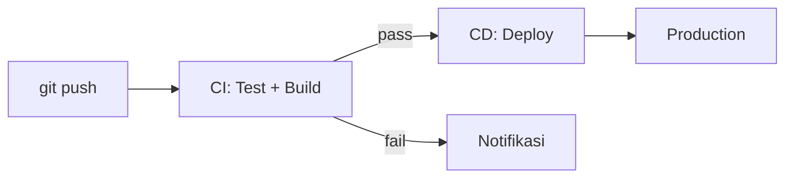

# CI/CD dengan GitHub Actions

CI/CD (Continuous Integration/Continuous Deployment) mengotomatisasi testing dan deployment — setiap push ke GitHub langsung deploy ke production.

## Konsep CI/CD



**Continuous Integration:**
- Setiap push → jalankan test otomatis
- Cegah kode rusak masuk ke main branch

**Continuous Deployment:**
- Setiap merge ke main → deploy otomatis
- Zero-downtime deployment

## GitHub Actions Dasar

```yaml
# .github/workflows/deploy.yml
name: Deploy to Production

on:
  push:
    branches: [main]
  pull_request:
    branches: [main]

jobs:
  test:
    runs-on: ubuntu-latest
    steps:
      - uses: actions/checkout@v4

      - name: Setup Bun
        uses: oven-sh/setup-bun@v2
        with:
          bun-version: latest

      - name: Install dependencies
        run: bun install

      - name: Type check
        run: bun run check

      - name: Run tests
        run: bun test

  deploy:
    needs: test
    runs-on: ubuntu-latest
    if: github.ref == 'refs/heads/main'
    steps:
      - uses: actions/checkout@v4

      - name: Deploy to server
        uses: appleboy/ssh-action@v1
        with:
          host: ${{ secrets.SERVER_HOST }}
          username: ${{ secrets.SERVER_USER }}
          key: ${{ secrets.SSH_PRIVATE_KEY }}
          script: |
            cd /app/smauii-lab
            git pull origin main
            bun install
            bun run build
            pm2 restart smauii-lab
```

## Deploy ke Cloudflare Pages

```yaml
  deploy-cf:
    needs: test
    runs-on: ubuntu-latest
    steps:
      - uses: actions/checkout@v4
        with:
          submodules: true  # Penting untuk smauii-dev-content

      - uses: oven-sh/setup-bun@v2

      - run: bun install && bun run build

      - name: Deploy to Cloudflare Pages
        uses: cloudflare/wrangler-action@v3
        with:
          apiToken: ${{ secrets.CF_API_TOKEN }}
          command: pages deploy dist --project-name=smauii-lab
```

## Monitoring dengan Uptime Kuma

```bash
# Self-hosted monitoring
docker run -d \
  --name uptime-kuma \
  -p 3001:3001 \
  -v uptime-kuma:/app/data \
  --restart unless-stopped \
  louislam/uptime-kuma:1
```

## Log Management

```bash
# PM2 — process manager untuk Node.js
npm install -g pm2

pm2 start dist/server/entry.mjs --name smauii-lab
pm2 logs smauii-lab
pm2 monit

# Logrotate
pm2 install pm2-logrotate
pm2 set pm2-logrotate:max_size 10M
pm2 set pm2-logrotate:retain 7
```

## Latihan

1. Buat workflow GitHub Actions yang:
   - Jalankan `bun run check` di setiap PR
   - Deploy ke VPS saat merge ke main
2. Setup Uptime Kuma untuk monitor website
3. Konfigurasi alert email/Telegram jika website down
