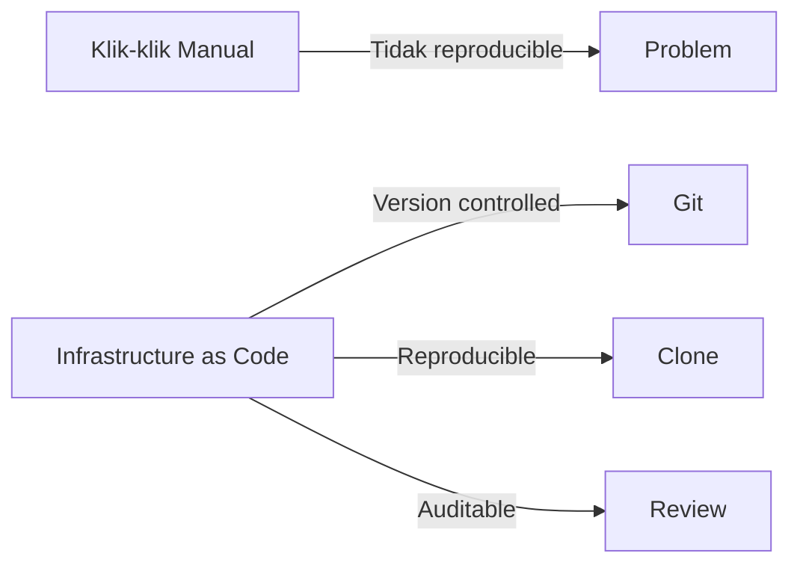

# Infrastructure as Code dengan Terraform

IaC memungkinkan kamu mendefinisikan infrastruktur sebagai kode — reproducible, version-controlled, dan dapat di-automate.

## Mengapa IaC?



## Terraform Dasar

```hcl
# main.tf — Deploy VPS di Cloudflare + DNS

terraform {
  required_providers {
    cloudflare = {
      source  = "cloudflare/cloudflare"
      version = "~> 4.0"
    }
  }
}

provider "cloudflare" {
  api_token = var.cloudflare_api_token
}

# DNS Record
resource "cloudflare_record" "lab" {
  zone_id = var.zone_id
  name    = "lab"
  value   = var.server_ip
  type    = "A"
  ttl     = 300
  proxied = true  # Aktifkan Cloudflare proxy
}

resource "cloudflare_record" "www" {
  zone_id = var.zone_id
  name    = "www"
  value   = "lab.smauiiyk.sch.id"
  type    = "CNAME"
  proxied = true
}

# Workers KV Namespace
resource "cloudflare_workers_kv_namespace" "cache" {
  account_id = var.account_id
  title      = "smauii-content-cache"
}

# Variables
variable "cloudflare_api_token" {
  sensitive = true
}
variable "zone_id" {}
variable "server_ip" {}
variable "account_id" {}
```

```bash
# terraform.tfvars (jangan commit!)
cloudflare_api_token = "xxx"
zone_id = "yyy"
server_ip = "1.2.3.4"
account_id = "zzz"
```

```bash
terraform init    # Download providers
terraform plan    # Preview perubahan
terraform apply   # Terapkan
terraform destroy # Hapus semua resource
```

## Ansible — Configuration Management

```yaml
# playbook.yml — Setup web server
---
- hosts: webservers
  become: yes
  tasks:
    - name: Update apt cache
      apt:
        update_cache: yes

    - name: Install packages
      apt:
        name:
          - nginx
          - certbot
          - python3-certbot-nginx
        state: present

    - name: Copy Nginx config
      template:
        src: nginx.conf.j2
        dest: /etc/nginx/sites-available/smauii
      notify: reload nginx

    - name: Enable site
      file:
        src: /etc/nginx/sites-available/smauii
        dest: /etc/nginx/sites-enabled/smauii
        state: link

    - name: Get SSL certificate
      command: certbot --nginx -d lab.smauiiyk.sch.id --non-interactive --agree-tos -m admin@smauiiyk.sch.id

  handlers:
    - name: reload nginx
      service:
        name: nginx
        state: reloaded
```

```ini
# inventory.ini
[webservers]
server1 ansible_host=1.2.3.4 ansible_user=ubuntu
server2 ansible_host=5.6.7.8 ansible_user=ubuntu

[all&#x200B;:vars]
ansible_ssh_private_key_file=~/.ssh/id_ed25519
```

```bash
ansible-playbook -i inventory.ini playbook.yml
ansible all -i inventory.ini -m ping  # Test koneksi
```

## Latihan

1. Install Terraform
2. Setup Cloudflare DNS record dengan Terraform
3. Buat Ansible playbook untuk install dan konfigurasi Nginx
4. Combine: Terraform provision + Ansible configure
