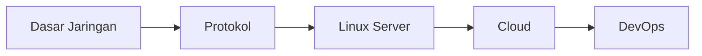

# Jaringan Komputer

Track ini mempersiapkan kamu untuk memahami infrastruktur digital — bagaimana internet bekerja dan cara mengelola server.

## Roadmap

## Modul

1. **Dasar Jaringan** — OSI model, TCP/IP, subnetting
2. **Protokol** — HTTP/S, DNS, SSH, FTP, SMTP
3. **Linux Server** — CLI, file system, user management, firewall
4. **Cloud** — AWS/GCP/Azure dasar, VPS, object storage
5. **DevOps** — Docker, CI/CD, monitoring

## Prasyarat

Tidak ada prasyarat khusus. Rasa ingin tahu tentang "bagaimana internet bekerja" sudah cukup.
