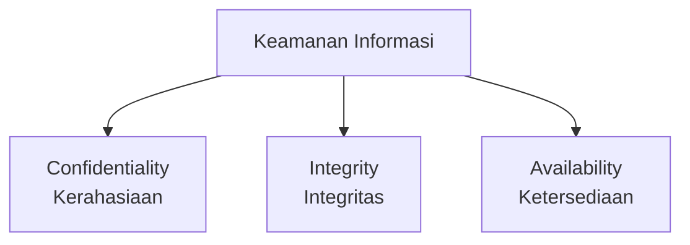
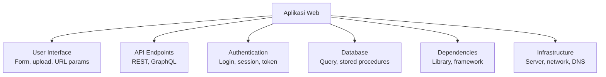

# CIA Triad & Threat Modeling

Sebelum bisa mengamankan sistem, kamu perlu memahami apa yang dilindungi dan dari ancaman apa.

## CIA Triad

Tiga pilar keamanan informasi:



### Confidentiality (Kerahasiaan)
Data hanya bisa diakses oleh yang berwenang.
- **Ancaman:** Data breach, eavesdropping, credential theft
- **Kontrol:** Enkripsi, access control, authentication

### Integrity (Integritas)
Data tidak dimodifikasi tanpa izin.
- **Ancaman:** Man-in-the-middle, SQL injection, file tampering
- **Kontrol:** Hashing, digital signature, checksums

### Availability (Ketersediaan)
Sistem tersedia saat dibutuhkan.
- **Ancaman:** DDoS, ransomware, hardware failure
- **Kontrol:** Redundancy, backup, rate limiting

## Threat Modeling

Proses sistematis untuk mengidentifikasi ancaman sebelum terjadi.

### Framework STRIDE

| Ancaman | Deskripsi | Contoh |
|---------|-----------|--------|
| **S**poofing | Pura-pura jadi orang lain | Phishing, session hijacking |
| **T**ampering | Modifikasi data | SQL injection, MITM |
| **R**epudiation | Menyangkal tindakan | Log manipulation |
| **I**nformation Disclosure | Bocor data | Data breach, verbose errors |
| **D**enial of Service | Ganggu ketersediaan | DDoS, resource exhaustion |
| **E**levation of Privilege | Dapat akses lebih tinggi | Privilege escalation |

### Attack Surface



Semakin kecil attack surface, semakin aman sistem.

## Defense in Depth

Jangan bergantung pada satu lapisan keamanan:

```
Layer 1: Perimeter (Firewall, WAF)
Layer 2: Network (VPN, segmentasi)
Layer 3: Host (Antivirus, patch management)
Layer 4: Application (Input validation, auth)
Layer 5: Data (Enkripsi, backup)
```

## Prinsip Least Privilege

> Berikan akses **minimum** yang diperlukan untuk menjalankan tugas.

```bash
# Buruk: jalankan aplikasi sebagai root
sudo node app.js

# Baik: buat user khusus dengan akses terbatas
sudo useradd -r -s /bin/false appuser
sudo -u appuser node app.js
```

## Latihan

1. Pilih satu aplikasi yang kamu gunakan (misal: aplikasi sekolah)
2. Identifikasi attack surface-nya — apa saja input yang diterima?
3. Buat threat model sederhana menggunakan STRIDE
4. Usulkan 3 kontrol keamanan untuk mengurangi risiko
