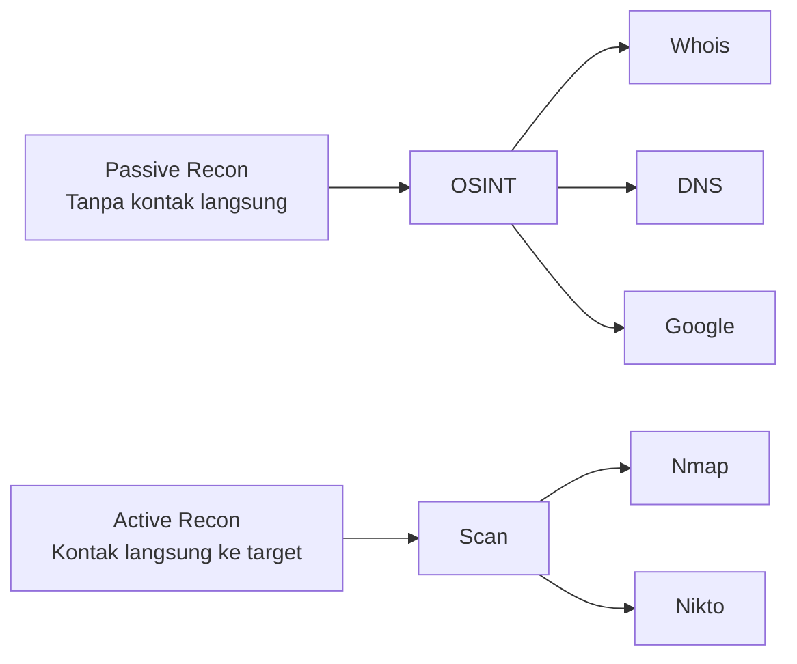

# Network Scanning & Reconnaissance

Reconnaissance adalah fase pertama penetration testing — mengumpulkan informasi tentang target sebanyak mungkin sebelum menyerang.

## Passive vs Active Recon



## Passive Reconnaissance

```bash
# WHOIS — info registrasi domain
whois smauiiyk.sch.id
whois 1.2.3.4

# DNS enumeration
dig smauiiyk.sch.id ANY
dig smauiiyk.sch.id MX
dig smauiiyk.sch.id NS

# Zone transfer (jika misconfigured)
dig axfr smauiiyk.sch.id @ns1.smauiiyk.sch.id

# Subfinder — temukan subdomain
subfinder -d smauiiyk.sch.id

# TheHarvester — email, subdomain, host
theHarvester -d smauiiyk.sch.id -b google,bing,linkedin
```

## Google Dorks

```
# Cari file sensitif
site:smauiiyk.sch.id filetype:pdf
site:smauiiyk.sch.id filetype:xlsx "password"
site:smauiiyk.sch.id inurl:admin
site:smauiiyk.sch.id "Index of /"

# Cari info yang tidak sengaja terekspos
"smauiiyk.sch.id" "password" filetype:txt
"smauiiyk.sch.id" "config" filetype:php
```

## Shodan — Internet-Connected Devices

```bash
# Cari server dengan port 22 terbuka di Indonesia
shodan search "country:ID port:22 org:Telkom"

# Cari webcam yang terekspos
shodan search "Netcam" country:ID

# Cari server dengan banner tertentu
shodan search "Server: Apache/2.2"
```

## Active Scanning dengan Nmap

```bash
# Discovery — host yang aktif
nmap -sn 192.168.1.0/24  # Ping scan

# Port scan
nmap -sV -sC 192.168.1.100   # Version + default scripts
nmap -p- 192.168.1.100       # Semua 65535 port
nmap -p 80,443,8080 target   # Port spesifik

# OS detection
nmap -O 192.168.1.100
nmap -A 192.168.1.100  # Aggressive: OS + version + scripts + traceroute

# Stealth scan (SYN scan)
nmap -sS 192.168.1.100

# UDP scan (lebih lambat)
nmap -sU -p 53,161,500 192.168.1.100

# Output ke file
nmap -oA scan_result 192.168.1.0/24  # XML, grepable, normal
nmap -oX scan.xml 192.168.1.100
```

## Nmap Scripts (NSE)

```bash
# Cek kerentanan HTTP
nmap --script http-vuln* 192.168.1.100

# Brute force SSH
nmap --script ssh-brute 192.168.1.100

# Enumerate SMB
nmap --script smb-enum-shares,smb-enum-users 192.168.1.100

# Semua script dalam kategori
nmap --script vuln 192.168.1.100
```

## Latihan

1. Lakukan passive recon terhadap domain sekolahmu sendiri
2. Scan VM Metasploitable2 dengan Nmap
3. Identifikasi semua service yang berjalan
4. Dokumentasikan temuan dalam format laporan
