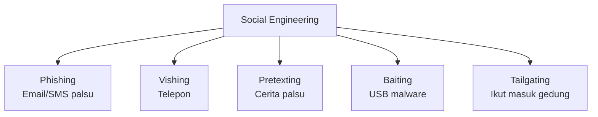

# Social Engineering & Phishing Awareness

"The human is the weakest link in security." — Kevin Mitnick

Teknik terbaik pun tidak berguna jika manusianya bisa dimanipulasi.

## Apa itu Social Engineering?

Social engineering adalah manipulasi psikologis untuk membuat orang memberikan informasi sensitif atau melakukan tindakan yang membahayakan keamanan.



## Phishing

Email phishing meniru institusi terpercaya untuk mencuri kredensial:

```
From: security@bca-indonesia.com  ← Domain palsu!
Subject: ⚠️ Akun Anda Akan Diblokir

Yth Nasabah,

Akun BCA Anda terdeteksi aktivitas mencurigakan.
Klik link berikut dalam 24 jam untuk verifikasi:

https://bca-secure-verify.com/login  ← Bukan domain BCA!
```

**Red flags:**
- Domain tidak cocok (bca.co.id bukan bca-indonesia.com)
- Urgensi berlebihan ("24 jam atau diblokir!")
- Minta password/OTP via email
- Link hover berbeda dari yang terlihat
- Typo dan tata bahasa buruk

## Cara Cek Email Asli

```bash
# Cek email header
# Di Gmail: titik tiga → "Show original"

# Verifikasi SPF/DKIM
nslookup -type=TXT bca.co.id
# Harus ada: v=spf1 ...

# Cek link tanpa klik
# Hover link → lihat URL di status bar
# Atau gunakan: https://checkshorturl.com
```

## Simulasi Phishing (untuk edukasi)

```python
# Dengan GoPhish — platform phishing simulation
# https://getgophish.com

# Buat kampanye simulasi phishing untuk test kesadaran karyawan/siswa
# HANYA untuk internal awareness training dengan izin
```

## Pretexting

Menyamar sebagai orang lain untuk mendapatkan informasi:

**Contoh skenario:**
> "Halo, ini dari IT support. Kami mendeteksi masalah di akun Anda. Bisa minta password untuk perbaikan?"

**Jawaban yang benar:** Tolak, dan verifikasi melalui saluran resmi.

## Vishing (Voice Phishing)

```
Skenario umum:
- "Ini dari bank BCA, kartu Anda diblokir, verifikasi dengan nomor kartu"
- "Ini dari Ditjen Pajak, ada tunggakan pajak Rp 5 juta"
- "Anda memenangkan hadiah, butuh transfer Rp 500rb untuk biaya admin"
```

## Kebijakan Keamanan yang Baik

```markdown
# Security Policy untuk Siswa/Karyawan

1. JANGAN pernah share password ke siapapun, termasuk IT support
2. Verifikasi identitas sebelum memberikan informasi sensitif
3. Laporkan email mencurigakan ke tim keamanan
4. Gunakan password manager (Bitwarden — gratis, open source)
5. Aktifkan 2FA di semua akun penting
6. Lock komputer saat meninggalkan meja
```

## Latihan

1. Analisis 5 email phishing nyata (cari di PhishTank.com)
2. Identifikasi teknik manipulasi yang digunakan
3. Buat poster "Tips Anti Phishing" untuk dipasang di lab komputer
4. Lakukan simulasi: kirim email "phishing" (tidak berbahaya) ke teman dengan izin, lihat berapa yang klik
