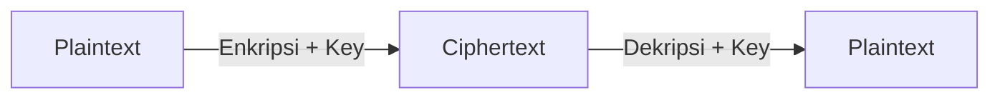
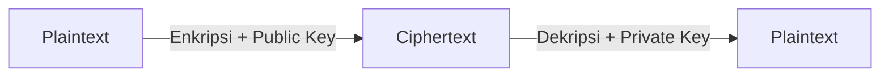
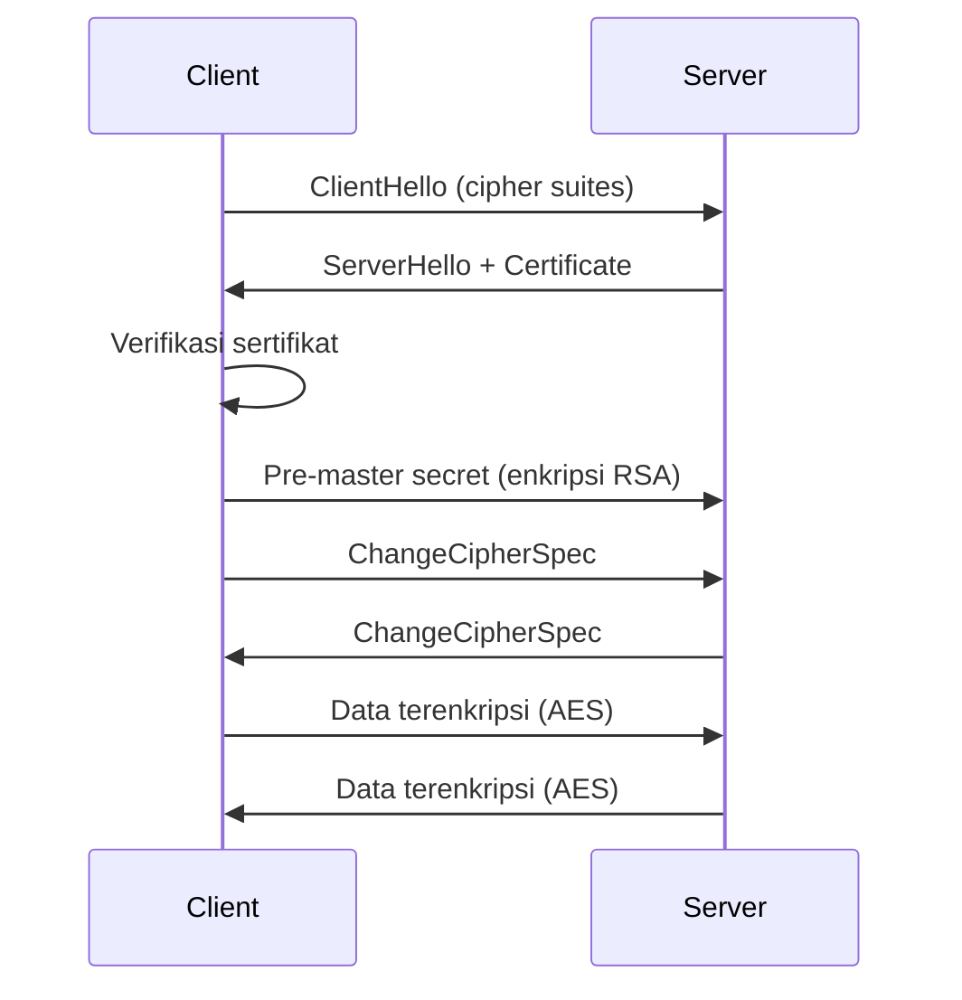

# Kriptografi Dasar

Kriptografi adalah fondasi keamanan digital — tanpanya, tidak ada password aman, tidak ada HTTPS, tidak ada transaksi online.

## Enkripsi Simetris

Satu kunci untuk enkripsi dan dekripsi:



**AES (Advanced Encryption Standard)** — standar industri:

```python
from cryptography.fernet import Fernet

# Generate key
key = Fernet.generate_key()
f = Fernet(key)

# Enkripsi
pesan = b"Rahasia banget!"
terenkripsi = f.encrypt(pesan)
print(terenkripsi)  # b'gAAAAAB...'

# Dekripsi
asli = f.decrypt(terenkripsi)
print(asli)  # b'Rahasia banget!'
```

**Masalah:** Bagaimana berbagi kunci dengan aman?

## Enkripsi Asimetris

Dua kunci: **public key** (boleh dibagikan) dan **private key** (rahasia):



**RSA:**

$$c = m^e \mod n$$
$$m = c^d \mod n$$

Di mana $(e, n)$ adalah public key dan $(d, n)$ adalah private key.

```python
from cryptography.hazmat.primitives.asymmetric import rsa, padding
from cryptography.hazmat.primitives import hashes

# Generate key pair
private_key = rsa.generate_private_key(
    public_exponent=65537,
    key_size=2048
)
public_key = private_key.public_key()

# Enkripsi dengan public key
ciphertext = public_key.encrypt(
    b"Pesan rahasia",
    padding.OAEP(
        mgf=padding.MGF1(algorithm=hashes.SHA256()),
        algorithm=hashes.SHA256(),
        label=None
    )
)

# Dekripsi dengan private key
plaintext = private_key.decrypt(ciphertext, padding.OAEP(...))
```

## Hashing

Hash adalah fungsi satu arah — tidak bisa di-reverse:

$$H: \{0,1\}^* \rightarrow \{0,1\}^n$$

**Properti:**
- **Deterministic** — input sama → output sama
- **One-way** — tidak bisa balik dari hash ke input
- **Avalanche effect** — perubahan kecil → hash sangat berbeda
- **Collision resistant** — sulit cari dua input dengan hash sama

```python
import hashlib

# SHA-256
pesan = "password123"
hash_sha256 = hashlib.sha256(pesan.encode()).hexdigest()
print(hash_sha256)
# 8d969eef6ecad3c29a3a629280e686cf0c3f5d5a86aff3ca12020c923adc6c92

# Bcrypt untuk password (dengan salt)
import bcrypt
password = b"password123"
salt = bcrypt.gensalt()
hashed = bcrypt.hashpw(password, salt)
print(bcrypt.checkpw(password, hashed))  # True
```

> **Jangan** simpan password sebagai MD5 atau SHA-1 — sudah tidak aman. Gunakan **bcrypt**, **argon2**, atau **scrypt**.

## TLS/HTTPS



## Digital Signature

Membuktikan keaslian dan integritas dokumen:

```python
from cryptography.hazmat.primitives.asymmetric import padding
from cryptography.hazmat.primitives import hashes

# Sign dengan private key
signature = private_key.sign(
    b"Dokumen penting",
    padding.PSS(
        mgf=padding.MGF1(hashes.SHA256()),
        salt_length=padding.PSS.MAX_LENGTH
    ),
    hashes.SHA256()
)

# Verify dengan public key
public_key.verify(signature, b"Dokumen penting", ...)
```

## Latihan

1. Hash password "smauii2026" dengan SHA-256, MD5, dan bcrypt — bandingkan hasilnya
2. Generate RSA key pair, enkripsi pesan, dekripsi kembali
3. Cek sertifikat TLS website favoritmu: `openssl s_client -connect google.com:443`
