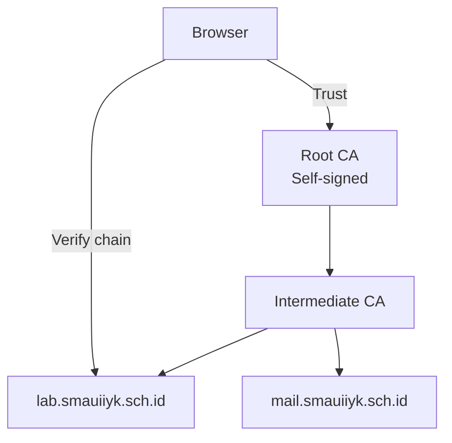

# Kriptografi Modern & PKI

Public Key Infrastructure (PKI) adalah sistem yang memungkinkan komunikasi aman di internet.

## PKI — Infrastruktur Kunci Publik



### Buat Certificate Authority Sendiri

```bash
# 1. Buat Root CA
openssl genrsa -out ca.key 4096
openssl req -new -x509 -days 3650 -key ca.key -out ca.crt \
  -subj "/C=ID/ST=DIY/L=Yogyakarta/O=SMA UII/CN=SMA UII Root CA"

# 2. Buat server certificate
openssl genrsa -out server.key 2048
openssl req -new -key server.key -out server.csr \
  -subj "/C=ID/ST=DIY/O=SMA UII/CN=lab.smauiiyk.sch.id"

# 3. Sign dengan CA
openssl x509 -req -days 365 -in server.csr \
  -CA ca.crt -CAkey ca.key -CAcreateserial \
  -out server.crt

# 4. Verifikasi
openssl verify -CAfile ca.crt server.crt
openssl x509 -in server.crt -text -noout
```

## PGP — Email Encryption

```bash
# Generate key pair
gpg --gen-key

# Export public key (bagikan ke orang lain)
gpg --export --armor your@email.com > public.asc

# Import public key orang lain
gpg --import their_public.asc

# Enkripsi file
gpg --encrypt --recipient their@email.com secret.txt
# Menghasilkan secret.txt.gpg

# Dekripsi
gpg --decrypt secret.txt.gpg

# Sign file (verifikasi keaslian)
gpg --sign document.pdf
gpg --verify document.pdf.sig document.pdf
```

## Diffie-Hellman Key Exchange

Cara dua pihak menyepakati kunci rahasia tanpa pernah mengirimkan kunci itu:

```python
# Simplified DH key exchange
import random

# Public parameters (bisa diketahui semua orang)
p = 23  # bilangan prima
g = 5   # generator

# Alice
a = random.randint(2, p-2)  # private key Alice
A = pow(g, a, p)             # public key Alice = g^a mod p

# Bob
b = random.randint(2, p-2)  # private key Bob
B = pow(g, b, p)             # public key Bob = g^b mod p

# Pertukaran public key (bisa di-intercept, tidak apa-apa)
# Alice dan Bob masing-masing hitung shared secret:
shared_alice = pow(B, a, p)  # B^a mod p = g^(ba) mod p
shared_bob = pow(A, b, p)    # A^b mod p = g^(ab) mod p

assert shared_alice == shared_bob
print(f"Shared secret: {shared_alice}")
```

## Analisis Sertifikat TLS

```bash
# Lihat sertifikat website
openssl s_client -connect google.com:443 -showcerts 2>/dev/null | openssl x509 -text

# Cek expiry date
echo | openssl s_client -connect google.com:443 2>/dev/null | \
  openssl x509 -noout -dates

# Cek cipher suite
nmap --script ssl-enum-ciphers -p 443 google.com

# SSL Labs test (online)
# https://www.ssllabs.com/ssltest/
```

## Latihan

1. Buat CA sendiri dan issue certificate untuk `localhost`
2. Setup Nginx dengan certificate tersebut
3. Enkripsi file dengan PGP dan tukarkan dengan teman
4. Implementasi Diffie-Hellman dengan bilangan prima lebih besar di Python
