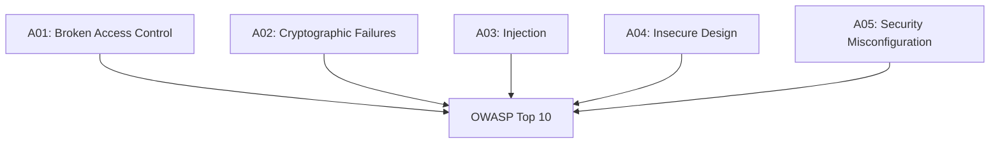

# Web Security — OWASP Top 10

OWASP (Open Web Application Security Project) menerbitkan daftar 10 kerentanan web paling kritis setiap beberapa tahun.

## OWASP Top 10 (2021)



## A03: SQL Injection

**Vulnerable:**
```python
# JANGAN PERNAH LAKUKAN INI
query = f"SELECT * FROM users WHERE email = '{email}'"
# Input: ' OR '1'='1
# Query: SELECT * FROM users WHERE email = '' OR '1'='1'
# Hasil: semua user ter-return!
```

**Secure:**
```python
# Parameterized query
cursor.execute("SELECT * FROM users WHERE email = ?", (email,))

# ORM (Drizzle, SQLAlchemy, Prisma) — otomatis aman
user = await db.query.users.findFirst({
    where: eq(users.email, email)
})
```

## A03: XSS (Cross-Site Scripting)

**Reflected XSS:**
```html
<!-- URL: /search?q=<script>document.cookie</script> -->
<p>Hasil pencarian: <script>document.cookie</script></p>
```

**Stored XSS:**
```javascript
// User menyimpan: 
// Setiap user yang melihat post ini → cookie dicuri
```

**Pencegahan:**
```javascript
// Escape output
function escapeHtml(str) {
  return str
    .replace(/&/g, "&amp;")
    .replace(/</g, "&lt;")
    .replace(/>/g, "&gt;")
    .replace(/"/g, "&quot;");
}

// Content Security Policy header
"Content-Security-Policy: default-src 'self'; script-src 'self'"

// React/Astro otomatis escape — jangan pakai dangerouslySetInnerHTML
```

## A01: Broken Access Control

```javascript
// Vulnerable — user bisa akses data orang lain
app.get("/api/profile/:userId", async (req, res) => {
  const user = await db.getUser(req.params.userId);
  res.json(user);
});

// Secure — verifikasi ownership
app.get("/api/profile/:userId", requireAuth, async (req, res) => {
  if (req.user.id !== req.params.userId && req.user.role !== "admin") {
    return res.status(403).json({ error: "Forbidden" });
  }
  const user = await db.getUser(req.params.userId);
  res.json(user);
});
```

## A07: Authentication Failures

```javascript
// Buruk — password plaintext
await db.insert(users).values({ password: req.body.password });

// Buruk — MD5/SHA1
const hash = crypto.createHash("md5").update(password).digest("hex");

// Benar — argon2 dengan salt otomatis
import { hash, verify } from "@node-rs/argon2";
const passwordHash = await hash(password, {
    memoryCost: 19456,
    timeCost: 2,
    outputLen: 32,
    parallelism: 1,
});
```

## Security Headers

```javascript
// Middleware security headers
app.use((req, res, next) => {
  res.setHeader("X-Content-Type-Options", "nosniff");
  res.setHeader("X-Frame-Options", "DENY");
  res.setHeader("X-XSS-Protection", "1; mode=block");
  res.setHeader("Strict-Transport-Security", "max-age=31536000; includeSubDomains");
  res.setHeader("Content-Security-Policy",
    "default-src 'self'; script-src 'self' 'unsafe-inline'");
  next();
});
```

## Latihan

Setup lab keamanan dengan DVWA (Damn Vulnerable Web Application):
```bash
docker run -d -p 8080:80 vulnerables/web-dvwa
```
1. Coba SQL injection di login form
2. Coba stored XSS di guestbook
3. Perbaiki kerentanan tersebut di kode
