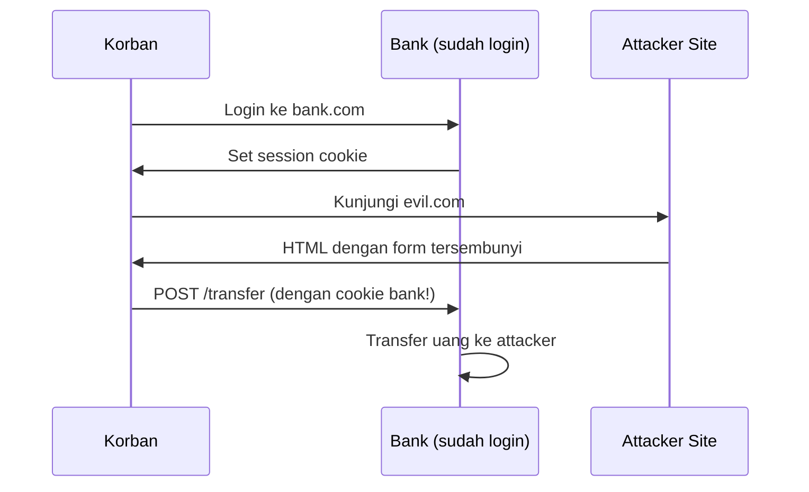
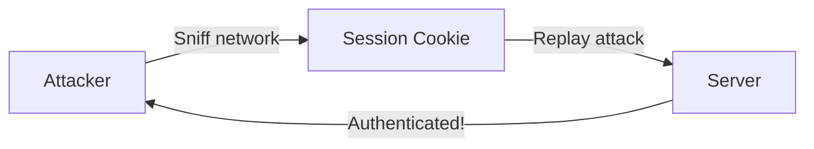

# Web Application Security — CSRF & Session

Setelah XSS dan SQL Injection, CSRF dan session attacks adalah kerentanan web paling umum berikutnya.

## CSRF — Cross-Site Request Forgery

Attacker membuat korban mengirim request yang tidak disengaja ke website yang sudah login.

### Skenario Serangan



### Serangan

```html
<!-- Di evil.com — form tersembunyi yang auto-submit -->
<form action="https://bank.com/transfer" method="POST" id="csrf-form">
  <input type="hidden" name="to" value="attacker-account">
  <input type="hidden" name="amount" value="1000000">
</form>
<script>document.getElementById("csrf-form").submit();</script>
```

### Pencegahan — CSRF Token

```javascript
// Server: generate token unik per session
const csrfToken = crypto.randomBytes(32).toString("hex");
session.csrfToken = csrfToken;

// HTML form
<input type="hidden" name="_csrf" value={csrfToken}>

// Server: validasi token
app.post("/transfer", (req, res) => {
  if (req.body._csrf !== req.session.csrfToken) {
    return res.status(403).json({ error: "Invalid CSRF token" });
  }
  // Proses transfer
});

// SameSite cookie attribute (modern approach)
res.cookie("session", token, {
  httpOnly: true,
  secure: true,
  sameSite: "strict"  // Blokir cross-site requests
});
```

## Session Security

### Session Hijacking



### Pencegahan

```javascript
// 1. Regenerate session ID setelah login
req.session.regenerate((err) => {
  req.session.userId = user.id;
  res.redirect("/dashboard");
});

// 2. Bind session ke IP + User-Agent
const sessionFingerprint = crypto
  .createHash("sha256")
  .update(req.ip + req.headers["user-agent"])
  .digest("hex");

// 3. Session timeout
req.session.cookie.maxAge = 30 * 60 * 1000; // 30 menit
req.session.lastActivity = Date.now();

// Middleware cek timeout
app.use((req, res, next) => {
  if (req.session.lastActivity &&
      Date.now() - req.session.lastActivity > 30 * 60 * 1000) {
    req.session.destroy();
    return res.redirect("/login?expired=1");
  }
  req.session.lastActivity = Date.now();
  next();
});
```

## Clickjacking

```html
<!-- Attacker overlay iframe di atas tombol "Like" -->
<iframe src="https://facebook.com/like?page=attacker"
  style="opacity: 0; position: absolute; top: 0; left: 0;">
</iframe>
<button>Klik untuk hadiah!</button>
```

**Pencegahan:**
```javascript
// X-Frame-Options header
res.setHeader("X-Frame-Options", "DENY");

// Content Security Policy
res.setHeader("Content-Security-Policy", "frame-ancestors 'none'");
```

## Security Checklist Web App

```markdown
Authentication:
- [ ] Password di-hash dengan bcrypt/argon2
- [ ] Rate limiting di endpoint login
- [ ] Multi-factor authentication
- [ ] Session timeout

Authorization:
- [ ] Cek ownership sebelum akses resource
- [ ] Principle of least privilege
- [ ] Server-side authorization (jangan hanya client-side)

Input/Output:
- [ ] Validasi semua input di server
- [ ] Escape output (cegah XSS)
- [ ] Parameterized query (cegah SQLi)
- [ ] File upload validation

Transport:
- [ ] HTTPS everywhere
- [ ] HSTS header
- [ ] Secure + HttpOnly cookies
```

## Latihan

1. Setup DVWA dan exploit CSRF vulnerability
2. Implementasi CSRF protection di aplikasi Express.js
3. Audit security headers website kamu di [securityheaders.com](https://securityheaders.com)
