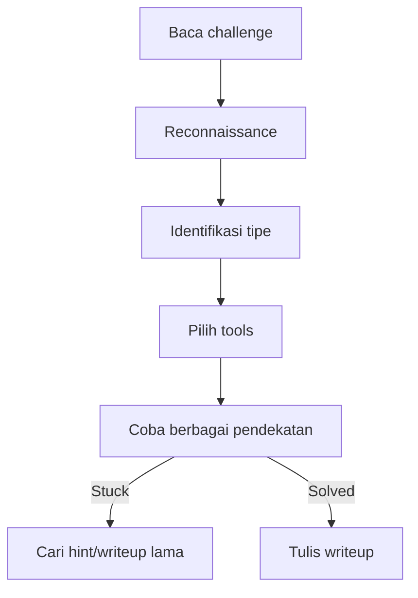

# CTF Writeup — Teknik dan Strategi

Writeup adalah dokumentasi cara menyelesaikan challenge CTF — penting untuk belajar dan berbagi.

## Strategi Umum CTF



**Tips:**
1. Baca challenge dengan teliti — petunjuk sering tersembunyi di deskripsi
2. Cek semua metadata file
3. Jangan terpaku satu pendekatan — pivot jika stuck
4. Dokumentasikan setiap langkah

## Steganography

```bash
# Analisis gambar
file image.png
exiftool image.png
strings image.png | grep -i flag

# Cek data tersembunyi
steghide extract -sf image.jpg -p ""
steghide extract -sf image.jpg -p "password"

# zsteg untuk PNG
zsteg image.png
zsteg -a image.png  # Coba semua metode

# Binwalk — cari file tersembunyi
binwalk image.png
binwalk -e image.png  # Extract

# LSB steganography manual
python3 -c "
from PIL import Image
img = Image.open('image.png')
pixels = list(img.getdata())
bits = ''.join([str(p[0] & 1) for p in pixels[:100]])
print(bits)
"
```

## Forensics

```bash
# Analisis file
file unknown.bin
xxd unknown.bin | head -20  # Hex dump
strings unknown.bin | grep -E "flag|CTF|smauii"

# Magic bytes — identifikasi format
# PNG: 89 50 4E 47
# JPEG: FF D8 FF
# ZIP: 50 4B 03 04
# PDF: 25 50 44 46

# Repair file header
printf '\x89\x50\x4e\x47' | dd of=broken.png bs=1 count=4 conv=notrunc

# Memory forensics
volatility3 -f memory.dmp windows.pslist
volatility3 -f memory.dmp windows.cmdline
volatility3 -f memory.dmp windows.filescan | grep flag
```

## Web CTF

```python
import requests

# Cek semua endpoint
for path in ["/admin", "/flag", "/secret", "/.git", "/robots.txt", "/.env"]:
    r = requests.get(f"http://challenge.ctf.io{path}")
    if r.status_code != 404:
        print(f"{path}: {r.status_code}")

# IDOR — Insecure Direct Object Reference
for user_id in range(1, 100):
    r = requests.get(f"http://challenge.ctf.io/user/{user_id}",
                     cookies={"session": "your_session"})
    if "flag" in r.text.lower():
        print(f"Found at user {user_id}: {r.text}")

# JWT manipulation
import jwt
import base64, json

token = "eyJhbGc..."
header, payload, sig = token.split(".")
decoded = json.loads(base64.b64decode(payload + "=="))
print(decoded)

# Ubah role dan sign ulang dengan "none" algorithm
decoded["role"] = "admin"
new_payload = base64.b64encode(json.dumps(decoded).encode()).decode().rstrip("=")
forged = f"{header}.{new_payload}."
```

## Contoh Writeup

```markdown
# Challenge: Hidden Message
**Category:** Steganography
**Points:** 100
**Flag:** CTF{h1dd3n_1n_p1x3ls}

## Deskripsi
Diberikan file `image.png`. Temukan pesan tersembunyi.

## Solusi

1. Cek metadata:
   ```bash
   exiftool image.png
   # Comment: "Look at the LSB"
   ```

2. Ekstrak LSB dengan zsteg:
   ```bash
   zsteg image.png
   # b1,r,lsb,xy .. text: "CTF{h1dd3n_1n_p1x3ls}"
   ```

## Pelajaran
LSB (Least Significant Bit) steganography menyembunyikan data di bit terakhir setiap pixel.
```

## Latihan

1. Selesaikan 3 challenge steganography di PicoCTF
2. Tulis writeup untuk setiap challenge
3. Publish writeup di blog atau GitHub
