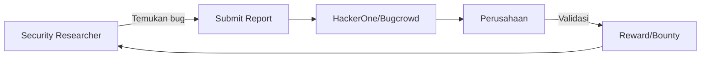

# Bug Bounty — Cara Kerja dan Memulai

Bug bounty program membayar peneliti keamanan yang menemukan dan melaporkan kerentanan secara bertanggung jawab.

## Ekosistem Bug Bounty



## Platform Terpopuler

| Platform | Fokus | URL |
|----------|-------|-----|
| HackerOne | Semua | hackerone.com |
| Bugcrowd | Semua | bugcrowd.com |
| Intigriti | EU focus | intigriti.com |
| Synack | Private | synack.com |
| YesWeHack | EU/Asia | yeswehack.com |

**Indonesia:**
- BSSN Bug Bounty
- Tokopedia (via HackerOne)
- Gojek (via HackerOne)

## Proses Responsible Disclosure

```
1. Temukan kerentanan
2. JANGAN eksploitasi berlebihan atau akses data user
3. Dokumentasikan dengan baik (PoC, impact, CVSS score)
4. Submit ke program bug bounty atau kontak security@company.com
5. Tunggu respons (biasanya 7-90 hari)
6. Koordinasi untuk fix
7. Terima reward
8. Public disclosure (setelah fix)
```

## Menulis Laporan yang Baik

```markdown
# SQL Injection di /api/search

## Summary
Parameter `q` di endpoint `/api/search` rentan terhadap SQL injection,
memungkinkan attacker mengakses semua data di database.

## Severity
Critical (CVSS 9.8)

## Steps to Reproduce
1. Login ke aplikasi
2. Akses: `GET /api/search?q=' OR 1=1--`
3. Response berisi semua data user

## Proof of Concept
```bash
curl -H "Authorization: Bearer $TOKEN" \
  "https://api.example.com/search?q=%27+OR+1%3D1--"
```

Response (truncated):
```json
{"users": [{"id": 1, "email": "admin@example.com"}, ...]}
```

## Impact
Attacker bisa mengakses semua data user termasuk email, password hash,
dan informasi pribadi lainnya.

## Remediation
Gunakan parameterized query:
```python
cursor.execute("SELECT * FROM users WHERE name LIKE ?", (f"%{query}%",))
```

## Timeline
- 2026-04-17: Discovery
- 2026-04-17: Reported to security@example.com
```

## Tools yang Digunakan Bug Hunter

```bash
# Recon
amass, subfinder, httpx, waybackurls

# Scanning
nuclei, dalfox (XSS), sqlmap, ffuf

# Manual testing
Burp Suite Community, OWASP ZAP

# Wordlists
SecLists (github.com/danielmiessler/SecLists)
```

## Tips Memulai

1. **Mulai dari program publik** — HackerOne Public Programs
2. **Fokus pada satu jenis bug** dulu — XSS atau IDOR
3. **Baca laporan publik** di HackerOne Hacktivity
4. **Ikuti komunitas** — Twitter/X #bugbounty, Discord
5. **Dokumentasikan semua** — bahkan temuan yang tidak valid

## Latihan

1. Daftar di HackerOne
2. Pilih 1 program publik yang sesuai skill
3. Baca scope dan rules dengan teliti
4. Coba temukan 1 kerentanan (XSS, IDOR, atau open redirect)
5. Submit laporan meski tidak dapat bounty — experience tetap berharga
