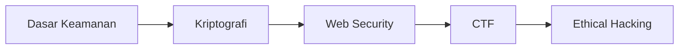

# Keamanan Siber

Track ini mempersiapkan kamu untuk memahami dan mempertahankan sistem dari ancaman siber — dengan etika dan legalitas yang benar.

## Roadmap

## Modul

1. **Dasar Keamanan** — CIA triad, threat model, attack surface
2. **Kriptografi** — Enkripsi simetris/asimetris, hashing, TLS
3. **Web Security** — OWASP Top 10, XSS, SQL injection, CSRF
4. **CTF** — Capture The Flag, tools, writeup
5. **Ethical Hacking** — Penetration testing methodology, reporting

## ⚠️ Etika

> Semua teknik yang dipelajari di track ini **hanya boleh** digunakan pada sistem yang kamu miliki atau sudah mendapat izin tertulis. Hacking tanpa izin adalah tindak pidana.

## Prasyarat

- Jaringan komputer dasar
- Linux CLI dasar
