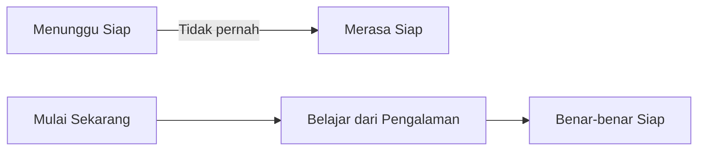

# Berhenti Menunggu Siap

"Nanti kalau sudah lulus." "Nanti kalau sudah lebih jago." "Nanti kalau sudah punya waktu."

Nanti tidak pernah datang. Yang ada hanya sekarang.

## Paradoks Kesiapan



Kesiapan tidak datang sebelum tindakan. Kesiapan datang **karena** tindakan.

Tidak ada developer yang merasa siap sebelum push kode pertama ke production. Tidak ada freelancer yang merasa siap sebelum mengirim proposal pertama. Tidak ada pengusaha yang merasa siap sebelum membuka bisnis pertama.

Mereka semua mulai dengan tidak siap.

## Biaya Menunggu

Setiap bulan yang kamu habiskan "mempersiapkan diri" adalah bulan yang tidak kamu habiskan untuk belajar dari dunia nyata.

```
Skenario A — Mulai sekarang (usia 17):
  17: Freelance pertama, gagal, belajar
  18: Klien kedua, mulai dapat bayaran
  19: Masuk kuliah dengan portfolio + penghasilan
  22: Lulus dengan 5 tahun pengalaman nyata

Skenario B — Tunggu lulus kuliah (usia 22):
  22: Mulai belajar hal-hal yang bisa dipelajari di usia 17
  24: Baru mulai dapat klien pertama
  25: Baru mulai membangun portfolio
```

Perbedaan 5 tahun pengalaman di usia 22 vs 27 adalah perbedaan yang sangat signifikan.

## Action Bias

Orang yang sukses cenderung punya **action bias** — kecenderungan untuk bertindak daripada menganalisis terlalu lama.

Bukan berarti ceroboh. Tapi mereka tahu bahwa:
- Informasi yang cukup untuk bertindak lebih baik dari informasi sempurna yang tidak pernah datang
- Kesalahan yang diperbaiki lebih berharga dari rencana yang sempurna di atas kertas
- Dunia nyata selalu lebih kompleks dari yang bisa direncanakan

## Apa yang Sebenarnya Kamu Takutkan?

Jujur dengan dirimu sendiri. Biasanya bukan "belum siap" — tapi salah satu dari ini:

- **Takut gagal** — dan terlihat bodoh di depan orang lain
- **Takut sukses** — dan ekspektasi orang naik
- **Takut komitmen** — karena kalau mulai, harus bertanggung jawab
- **Nyaman dengan status quo** — tidak nyaman itu menyakitkan

Semua ini normal. Tapi mengenalinya adalah langkah pertama untuk melewatinya.

## Minimum Viable Action

Jangan tanya "apa yang harus saya lakukan?" Tanya: **"apa hal terkecil yang bisa saya lakukan hari ini?"**

```
Ingin belajar coding?
  → Bukan: "Saya akan belajar 3 jam sehari mulai Senin"
  → Tapi:  "Saya akan buka satu lesson sekarang"

Ingin freelance?
  → Bukan: "Saya akan buat portofolio lengkap dulu"
  → Tapi:  "Saya akan DM satu orang yang mungkin butuh bantuan hari ini"

Ingin membangun LinkedIn?
  → Bukan: "Saya akan buat profil yang sempurna dulu"
  → Tapi:  "Saya akan isi nama dan foto sekarang"
```

## Latihan

Pilih satu hal yang sudah lama kamu tunda dengan alasan "belum siap":

1. Tulis alasan sebenarnya kamu menunda (jujur)
2. Identifikasi: apa hal terkecil yang bisa dilakukan dalam 10 menit?
3. Lakukan sekarang, sebelum menutup halaman ini
4. Catat bagaimana rasanya setelah melakukannya
