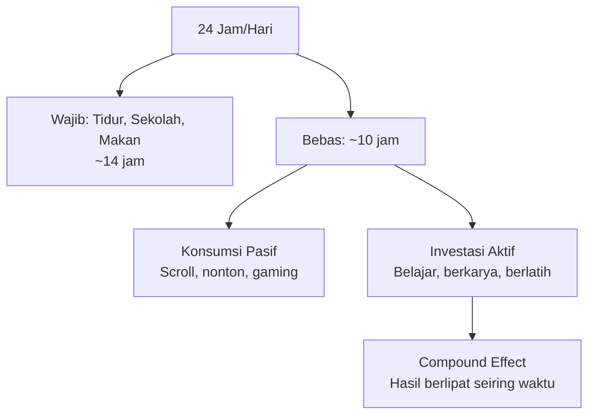

# Investasi Diri vs Konsumsi

Setiap jam yang kamu habiskan adalah investasi atau konsumsi. Tidak ada yang netral.

---

## Cermin yang Tidak Nyaman

Coba hitung dengan jujur. Dalam seminggu terakhir:
- Berapa jam kamu habiskan di TikTok, Instagram, atau YouTube tanpa tujuan?
- Berapa jam kamu habiskan untuk belajar sesuatu yang baru?
- Berapa jam kamu habiskan untuk mengerjakan sesuatu yang akan kamu banggakan 5 tahun ke depan?

Kebanyakan orang tidak mau menghitung karena jawabannya tidak menyenangkan.

Ini bukan tentang menghakimi. Ini tentang **kesadaran**. Kamu tidak bisa mengubah sesuatu yang tidak kamu sadari.

---

## Waktu adalah Satu-satunya Sumber Daya yang Tidak Bisa Diisi Ulang

Uang yang habis bisa dicari lagi. Waktu yang habis tidak pernah kembali.

Di usia 17, kamu punya aset yang tidak dimiliki orang berusia 30: **waktu dengan risiko rendah**. Kamu belum punya tanggungan keluarga, cicilan rumah, atau tekanan finansial besar. Ini adalah jendela emas untuk eksperimen.

Orang berusia 30 yang ingin belajar skill baru harus melakukannya sambil bekerja penuh waktu, mengurus keluarga, dan menanggung cicilan. Kamu bisa melakukannya dengan beban yang jauh lebih ringan.

---

## Peta Penggunaan Waktu



---

## Doom Scrolling — Pencuri Waktu Terbesar

Rata-rata remaja Indonesia menghabiskan **4-6 jam per hari** di media sosial. Sebagian besar adalah konsumsi pasif tanpa nilai.

Ini bukan tentang menghapus media sosial. Ini tentang **mengubah hubunganmu dengan media sosial**:

```
Konsumsi pasif (buang waktu):
  → Scroll tanpa tujuan
  → Nonton konten yang tidak menambah nilai
  → Membandingkan diri dengan orang lain
  → Doom scrolling berita negatif

Konsumsi aktif (investasi):
  → Follow akun yang mengajarkan skill baru
  → Simpan konten yang bisa diaplikasikan
  → Engage dengan komunitas yang relevan
  → Buat konten, bukan hanya konsumsi
```

Ada perbedaan besar antara menonton tutorial coding di YouTube dan menonton video lucu selama 3 jam. Keduanya menggunakan platform yang sama. Tapi hasilnya 5 tahun ke depan sangat berbeda.

---

## Compound Effect

Perbedaan kecil yang konsisten menghasilkan perbedaan besar seiring waktu:

$$\text{Hasil} = (1 + r)^t$$

Di mana $r$ adalah tingkat pertumbuhan harian dan $t$ adalah waktu.

```
1% lebih baik setiap hari selama setahun:
  (1.01)^365 = 37.78× lebih baik

1% lebih buruk setiap hari selama setahun:
  (0.99)^365 = 0.03× (hampir nol)
```

Ini bukan motivasi kosong — ini matematika. Konsistensi kecil mengalahkan usaha besar yang tidak konsisten.

Bayangkan dua siswa. Yang satu belajar 1 jam sehari, konsisten, selama 3 tahun SMA. Yang satu tidak belajar sama sekali di luar sekolah. Di akhir SMA, yang pertama punya lebih dari 1000 jam pengalaman nyata. Yang kedua punya nol.

---

## Audit Waktu

Sebelum bisa mengubah kebiasaan, kamu harus tahu kebiasaanmu:

```
Selama 3 hari ke depan, catat:
  - Jam berapa bangun dan tidur
  - Berapa jam di media sosial (cek Screen Time di HP)
  - Berapa jam belajar hal baru
  - Berapa jam untuk hal yang tidak kamu ingat besoknya

Pertanyaan jujur:
  "Jika saya terus menggunakan waktu seperti ini selama 5 tahun,
   di mana saya akan berada?"
```

---

## Desain Ulang Harimu

Tidak perlu revolusi. Cukup geser 1 jam per hari dari konsumsi ke investasi:

```
Sebelum:
  Pulang sekolah → scroll 3 jam → PR → tidur

Sesudah:
  Pulang sekolah → 1 jam belajar/berkarya → scroll 2 jam → PR → tidur

Dalam setahun: 365 jam investasi diri
Setara dengan: 9 minggu kerja penuh (40 jam/minggu)
```

Satu jam per hari. Itu saja. Tidak dramatis, tidak menyiksa. Tapi dalam setahun, perbedaannya luar biasa.

---

## Latihan

1. Cek Screen Time di HP-mu — berapa jam rata-rata per hari?
2. Identifikasi 3 akun yang kamu follow tapi tidak memberikan nilai nyata
3. Unfollow atau mute ketiganya
4. Follow 3 akun yang mengajarkan skill yang ingin kamu kuasai
5. Set timer 1 jam setiap hari untuk "deep work" — tidak ada notifikasi, tidak ada HP

Uang yang habis bisa dicari lagi. Waktu yang habis tidak pernah kembali.

Di usia 17, kamu punya aset yang tidak dimiliki orang berusia 30: **waktu dengan risiko rendah**. Kamu belum punya tanggungan keluarga, cicilan rumah, atau tekanan finansial besar. Ini adalah jendela emas untuk eksperimen.

## Peta Penggunaan Waktu


## Doom Scrolling — Pencuri Waktu Terbesar

Rata-rata remaja Indonesia menghabiskan **4-6 jam per hari** di media sosial. Sebagian besar adalah konsumsi pasif tanpa nilai.

Ini bukan tentang menghapus media sosial. Ini tentang **mengubah hubunganmu dengan media sosial**:

```
Konsumsi pasif (buang waktu):
  → Scroll tanpa tujuan
  → Nonton konten yang tidak menambah nilai
  → Membandingkan diri dengan orang lain
  → Doom scrolling berita negatif

Konsumsi aktif (investasi):
  → Follow akun yang mengajarkan skill baru
  → Simpan konten yang bisa diaplikasikan
  → Engage dengan komunitas yang relevan
  → Buat konten, bukan hanya konsumsi
```

## Compound Effect

Perbedaan kecil yang konsisten menghasilkan perbedaan besar seiring waktu:

$$\text{Hasil} = (1 + r)^t$$

Di mana $r$ adalah tingkat pertumbuhan harian dan $t$ adalah waktu.

```
1% lebih baik setiap hari selama setahun:
  (1.01)^365 = 37.78× lebih baik

1% lebih buruk setiap hari selama setahun:
  (0.99)^365 = 0.03× (hampir nol)
```

Ini bukan motivasi kosong — ini matematika. Konsistensi kecil mengalahkan usaha besar yang tidak konsisten.

## Audit Waktu

Sebelum bisa mengubah kebiasaan, kamu harus tahu kebiasaanmu:

```
Selama 3 hari ke depan, catat:
  - Jam berapa bangun dan tidur
  - Berapa jam di media sosial (cek Screen Time di HP)
  - Berapa jam belajar hal baru
  - Berapa jam untuk hal yang tidak kamu ingat besoknya

Pertanyaan jujur:
  "Jika saya terus menggunakan waktu seperti ini selama 5 tahun,
   di mana saya akan berada?"
```

## Desain Ulang Harimu

Tidak perlu revolusi. Cukup geser 1 jam per hari dari konsumsi ke investasi:

```
Sebelum:
  Pulang sekolah → scroll 3 jam → PR → tidur

Sesudah:
  Pulang sekolah → 1 jam belajar/berkarya → scroll 2 jam → PR → tidur

Dalam setahun: 365 jam investasi diri
Setara dengan: 9 minggu kerja penuh (40 jam/minggu)
```

## Latihan

1. Cek Screen Time di HP-mu — berapa jam rata-rata per hari?
2. Identifikasi 3 akun yang kamu follow tapi tidak memberikan nilai nyata
3. Unfollow atau mute ketiganya
4. Follow 3 akun yang mengajarkan skill yang ingin kamu kuasai
5. Set timer 1 jam setiap hari untuk "deep work" — tidak ada notifikasi, tidak ada HP
