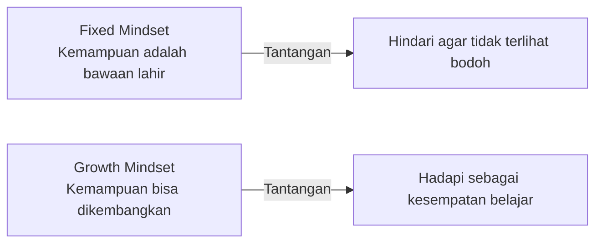

# Mindset Pertumbuhan vs Mindset Tetap

Penelitian Carol Dweck dari Stanford menemukan bahwa cara kamu memandang kemampuanmu menentukan seberapa jauh kamu bisa berkembang.

## Dua Cara Memandang Kemampuan



| Fixed Mindset | Growth Mindset |
|---------------|----------------|
| "Saya tidak berbakat coding" | "Saya belum bisa coding — tapi bisa belajar" |
| Menghindari tantangan | Mencari tantangan |
| Menyerah saat kesulitan | Bertahan saat kesulitan |
| Melihat usaha sebagai tanda kelemahan | Melihat usaha sebagai jalan menuju keahlian |
| Mengabaikan kritik | Belajar dari kritik |
| Merasa terancam oleh kesuksesan orang lain | Terinspirasi oleh kesuksesan orang lain |

## Kegagalan adalah Data

Orang dengan fixed mindset melihat kegagalan sebagai bukti ketidakmampuan. Orang dengan growth mindset melihat kegagalan sebagai informasi.

```
Fixed: "Saya gagal → Saya memang tidak berbakat → Berhenti mencoba"

Growth: "Saya gagal → Apa yang bisa saya pelajari? → Coba lagi dengan pendekatan berbeda"
```

Thomas Edison gagal ribuan kali sebelum menemukan bola lampu. Ketika ditanya tentang kegagalannya, dia berkata: "Saya tidak gagal. Saya hanya menemukan 10.000 cara yang tidak berhasil."

## Kata "Belum"

Satu kata yang mengubah segalanya:

```
"Saya tidak bisa coding"
→ "Saya belum bisa coding"

"Saya tidak mengerti machine learning"
→ "Saya belum mengerti machine learning"

"Saya tidak punya klien"
→ "Saya belum punya klien"
```

"Belum" mengakui kondisi saat ini sekaligus membuka kemungkinan perubahan.

## Zona Nyaman, Zona Belajar, Zona Panik

```
Zona Nyaman:    Hal yang sudah kamu kuasai → tidak ada pertumbuhan
Zona Belajar:   Sedikit di luar kemampuan saat ini → pertumbuhan optimal
Zona Panik:     Jauh di luar kemampuan → overwhelmed, tidak efektif
```

Pertumbuhan terjadi di zona belajar — cukup tidak nyaman untuk menantang, tapi tidak terlalu tidak nyaman hingga melumpuhkan.

## Latihan

1. Identifikasi 1 area di mana kamu punya fixed mindset ("saya tidak bisa X")
2. Ubah kalimat tersebut dengan menambahkan "belum"
3. Cari 1 orang yang sudah berhasil di area tersebut — bagaimana mereka memulai?
4. Ambil 1 langkah kecil ke zona belajar hari ini
5. Catat: apa yang kamu pelajari dari langkah tersebut?
