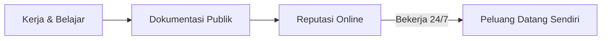

# Membangun Reputasi Online

Recruiter, klien, dan kolaborator akan Google namamu sebelum bertemu denganmu. Apa yang mereka temukan?

## Reputasi Online adalah Aset



Orang dengan reputasi online yang kuat tidak perlu melamar pekerjaan — pekerjaan datang kepada mereka.

## Ekosistem Identitas Digital

Setiap platform punya peran berbeda:

| Platform | Fungsi | Audiens |
|----------|--------|---------|
| **GitHub** | Portofolio teknis, bukti kemampuan | Developer, recruiter tech |
| **LinkedIn** | Jaringan profesional, karir | Recruiter, profesional |
| **Twitter/X** | Pikiran, diskusi, networking | Komunitas tech, founder |
| **Instagram** | Personal brand visual | Klien kreatif, komunitas |
| **Blog/Website** | Otoritas, SEO, pemikiran panjang | Semua audiens |

Tidak perlu semua. Pilih 2-3 yang paling relevan dengan tujuanmu.

## GitHub sebagai Portofolio Hidup

GitHub profile-mu adalah CV yang tidak bisa dipalsukan — setiap commit punya timestamp.

```
GitHub profile yang kuat:
  ✅ README profile yang menceritakan siapa kamu
  ✅ Contribution graph yang aktif (hijau)
  ✅ Proyek dengan README yang jelas
  ✅ Kontribusi ke proyek open source
  ✅ Konsistensi — lebih baik commit kecil setiap hari
     daripada commit besar sekali sebulan
```

**Cara membuat README profile GitHub:**
1. Buat repo dengan nama sama dengan username-mu
2. Buat `README.md` di repo tersebut
3. Isi dengan: siapa kamu, apa yang kamu kerjakan, skill, cara kontak

## Prinsip "Build in Public"

Dokumentasikan perjalanan belajarmu secara publik:

```
Bukan: "Saya sudah jago X"
Tapi:  "Hari ini saya belajar X dan ini yang saya temukan..."

Bukan: "Proyek saya sudah selesai"
Tapi:  "Ini proses saya membangun proyek ini, termasuk kesalahan yang saya buat..."
```

Orang lebih relate dengan perjalanan daripada kesempurnaan. Dan perjalanan yang didokumentasikan membangun kepercayaan lebih kuat dari klaim.

## Konsistensi > Kesempurnaan

```
❌ Strategi yang gagal:
  Buat 10 konten bagus sekaligus → diam 2 bulan → ulangi

✅ Strategi yang berhasil:
  1 konten per minggu, konsisten, selama setahun
  = 52 konten yang membangun momentum
```

Algoritma semua platform reward konsistensi. Audiens juga.

## Apa yang Tidak Boleh Ada di Online-mu

Reputasi butuh bertahun-tahun untuk dibangun, tapi bisa hancur dalam hitungan jam:

```
Hindari:
  → Komentar kasar atau merendahkan orang lain
  → Opini politik/agama yang provokatif (kecuali itu memang brand-mu)
  → Konten yang bisa disalahartikan di luar konteks
  → Mengeluh tentang klien, atasan, atau sekolah secara publik
  → Berbagi informasi sensitif orang lain tanpa izin

Aturan sederhana:
  "Apakah saya nyaman jika calon employer/klien melihat ini?"
  Jika tidak → jangan post.
```

## Latihan

1. Google namamu sendiri — apa yang muncul?
2. Audit semua akun sosial media-mu — ada yang perlu dibersihkan?
3. Buat atau update GitHub profile README
4. Tulis 1 post "build in public" tentang sesuatu yang sedang kamu pelajari
5. Tentukan: platform mana yang akan jadi fokus utamamu? Mengapa?
