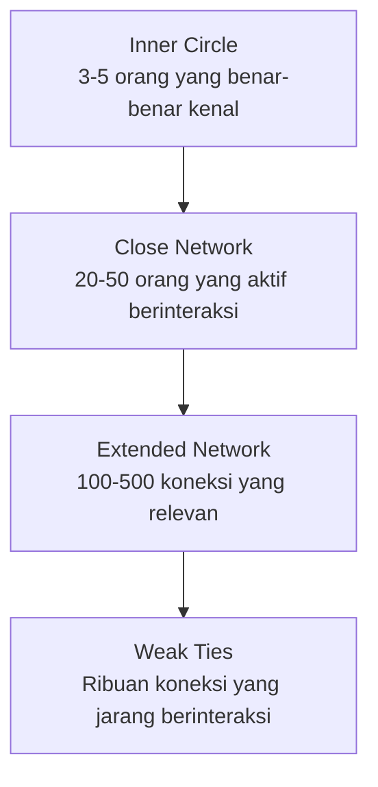

# Networking yang Tidak Terasa Networking

"Networking" terdengar transaksional dan tidak nyaman. Tapi membangun relasi yang tulus adalah salah satu investasi terpenting dalam karir.

## Networking yang Salah vs Benar

```
❌ Networking transaksional:
  "Halo, saya butuh koneksi. Bisa bantu saya?"
  → Orang langsung tahu kamu hanya butuh sesuatu

✅ Networking yang tulus:
  Berikan nilai dulu. Bantu tanpa mengharapkan imbalan.
  Jadilah orang yang menarik untuk dikenal.
  → Relasi terbentuk secara natural
```

## Prinsip "Give First"

Sebelum meminta apapun dari seseorang, tanya: **"Apa yang bisa saya berikan?"**

```
Cara memberikan nilai tanpa pengalaman:
  → Share konten mereka dengan komentar yang substantif
  → Kirim artikel yang relevan dengan pekerjaan mereka
  → Bantu menjawab pertanyaan di komunitas
  → Berikan feedback yang jujur dan konstruktif
  → Rekomendasikan mereka ke orang lain
```

## Lingkaran Relasi



**Paradoks weak ties:** Pekerjaan dan peluang paling sering datang dari **weak ties** — orang yang tidak terlalu dekat denganmu, tapi bergerak di lingkaran berbeda dan punya informasi yang tidak kamu miliki.

## Mentor

Mentor yang tepat bisa mempersingkat kurva belajarmu bertahun-tahun.

```
Cara mendapatkan mentor:
  1. Identifikasi: siapa yang sudah ada di tempat yang ingin kamu tuju?
  2. Pelajari karya dan pemikiran mereka terlebih dahulu
  3. Mulai dengan pertanyaan spesifik, bukan "bisa jadi mentor saya?"
  4. Tunjukkan bahwa kamu serius dengan tindakan, bukan kata-kata
  5. Hargai waktu mereka — datang dengan pertanyaan yang sudah dipikirkan

Pertanyaan yang baik untuk mentor:
  "Saya sedang menghadapi [masalah spesifik]. Saya sudah mencoba [X dan Y].
   Berdasarkan pengalamanmu, apa yang akan kamu lakukan berbeda?"
```

## Komunitas sebagai Leverage

Bergabung dengan komunitas yang tepat memberikan akses ke:
- Informasi yang tidak ada di Google
- Peluang yang tidak diiklankan secara publik
- Feedback dari orang yang sudah melewati jalan yang sama
- Kolaborasi yang mempercepat pertumbuhan

**Komunitas yang relevan untuk siswa SMA tech:**
- Digital Lab SMA UII (kamu sudah di sini)
- Komunitas developer lokal Yogyakarta
- Discord komunitas tech Indonesia
- GitHub Discussions proyek open source yang kamu gunakan

## Latihan

1. Identifikasi 3 orang yang ingin kamu kenal lebih baik (bisa online atau offline)
2. Untuk masing-masing: apa yang bisa kamu berikan kepada mereka?
3. Kirim 1 pesan yang memberikan nilai (bukan meminta sesuatu) kepada salah satu dari mereka hari ini
4. Bergabung dengan 1 komunitas online yang relevan dengan minatmu
5. Aktif berkontribusi di komunitas tersebut selama 2 minggu sebelum meminta apapun
