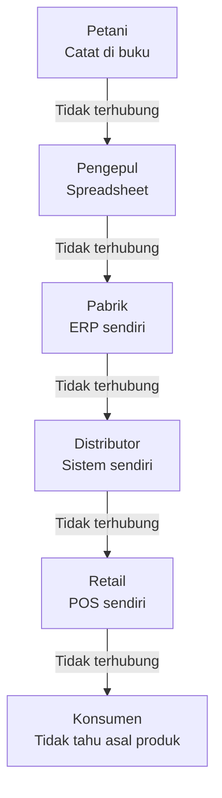
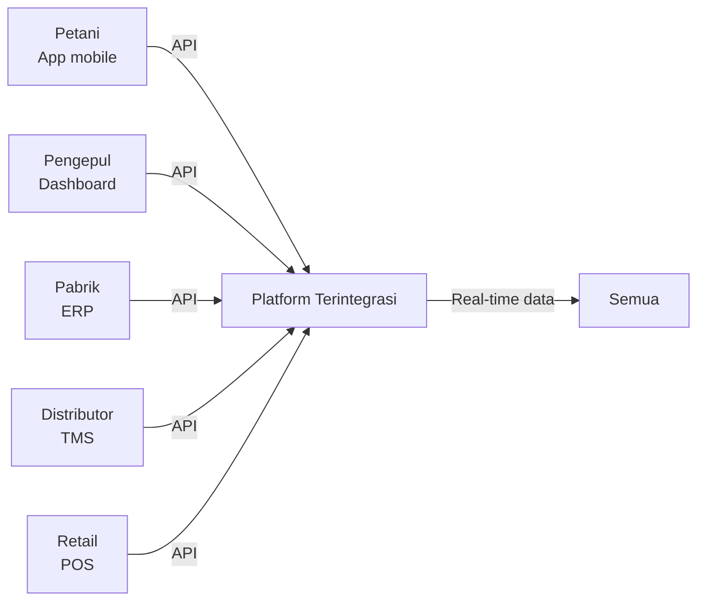

# Integrasi Rantai Pasok Digital

Masalah terbesar bukan kurangnya teknologi — tapi kurangnya integrasi antar sistem yang sudah ada.

## Masalah Fragmentasi



Setiap titik punya sistem sendiri yang tidak bicara satu sama lain. Hasilnya:
- Informasi hilang di setiap perpindahan
- Tidak ada visibilitas end-to-end
- Keputusan dibuat berdasarkan data yang tidak lengkap
- Pemborosan di setiap titik

## Visi Rantai Pasok Terintegrasi



Ketika semua terhubung:
- Petani tahu harga pasar real-time
- Pabrik tahu stok bahan baku secara akurat
- Distributor bisa optimasi rute pengiriman
- Retail bisa prediksi demand
- Konsumen bisa trace asal produk

## Peran Developer dalam Integrasi

Sebagai developer, kamu bisa berkontribusi di berbagai level:

```
Level 1 — Digitalisasi titik:
  → Buat app sederhana untuk petani mencatat hasil panen
  → Buat POS untuk warung
  → Buat sistem inventory untuk UMKM

Level 2 — Integrasi dua titik:
  → Hubungkan app petani dengan platform marketplace
  → Integrasi POS dengan sistem akuntansi
  → Hubungkan inventory dengan e-commerce

Level 3 — Platform:
  → Bangun platform yang menghubungkan banyak titik
  → API yang bisa dipakai oleh berbagai sistem
  → Dashboard analytics untuk seluruh rantai
```

## Contoh Nyata: Agritech Indonesia

```
Masalah: Petani cabai di Jawa tidak tahu harga di Jakarta
Solusi: App yang menampilkan harga real-time dari berbagai pasar

Masalah: Tengkulak ambil margin besar karena informasi asimetris
Solusi: Platform yang menghubungkan petani langsung ke pembeli

Masalah: Bank tidak mau kasih kredit ke petani karena tidak ada data
Solusi: App pencatatan yang menghasilkan "credit score" berbasis data pertanian
```

Startup yang sudah berhasil: Tanihub, Sayurbox, eFishery, iGrow.

## Cara Memulai Berkontribusi

```
1. Pilih 1 industri yang kamu pahami atau tertarik
2. Identifikasi 1 masalah spesifik di rantai pasok-nya
3. Buat solusi minimal yang bisa diuji (MVP)
4. Test dengan pengguna nyata
5. Iterasi berdasarkan feedback

Tidak perlu langsung membangun platform besar.
Mulai dari 1 masalah, 1 solusi, 1 pengguna.
```

## Latihan

1. Pilih 1 produk yang kamu konsumsi sehari-hari (nasi, kopi, baju, dll)
2. Trace rantai pasoknya dari produsen hingga ke tanganmu
3. Identifikasi: di titik mana ada masalah terbesar?
4. Riset: apakah sudah ada startup yang mencoba menyelesaikan masalah tersebut?
5. Buat sketsa solusi sederhana yang bisa kamu buat dengan skill yang kamu miliki saat ini
