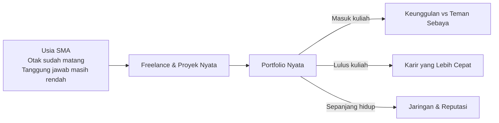

# Peta Karir — Dari Sekolah ke Dunia Nyata

Track ini berbeda dari semua track lainnya. Tidak ada kode, tidak ada rumus, tidak ada tools yang harus diinstall.

Ini adalah **peta berpikir** — tentang bagaimana kamu memposisikan diri di dunia yang jauh lebih kompleks dari yang diajarkan di kelas.

---

## Premis Utama

Lingkungan akademis adalah ruang eksplorasi dan inkubasi yang luar biasa. Tapi tidak ada ruang yang lebih baik untuk **implementasi** selain kehidupan nyata dan pekerjaan nyata sehari-hari.

Kamu sudah cukup umur untuk mulai. Jangan tunggu lulus. Jangan tunggu "siap".

---

## Mengapa Mulai Sekarang?

Teman-temanmu yang mulai di usia 22 (setelah lulus kuliah) akan menghabiskan 2-3 tahun pertama untuk belajar hal-hal yang bisa kamu pelajari sekarang — dengan risiko yang jauh lebih rendah.

---

## Apa yang Akan Kamu Pelajari

1. **Mindset Dasar** — cara berpikir yang membedakan orang yang berkembang dari yang stagnan
2. **Identitas Digital** — membangun reputasi online yang bekerja untukmu 24/7
3. **Freelance Pertama** — dari nol hingga klien pertama, tanpa pengalaman
4. **Ekosistem Industri** — memahami rantai pasok nyata: dari pertanian hingga tech
5. **Navigasi Karir** — membuat keputusan karir yang tidak menyesal

---

## Satu Hal yang Perlu Kamu Terima Sekarang

> Dunia tidak peduli dengan nilai rapormu. Dunia peduli dengan apa yang bisa kamu **lakukan** dan **buktikan**.

Ijazah membuka pintu. Portfolio menentukan apakah kamu masuk atau tidak.

---

## Prasyarat

Tidak ada prasyarat teknis. Yang dibutuhkan hanya satu: **kemauan untuk tidak nyaman**.

Semua pelajaran di track ini akan terasa tidak nyaman pada awalnya. Itu tanda kamu sedang tumbuh.
