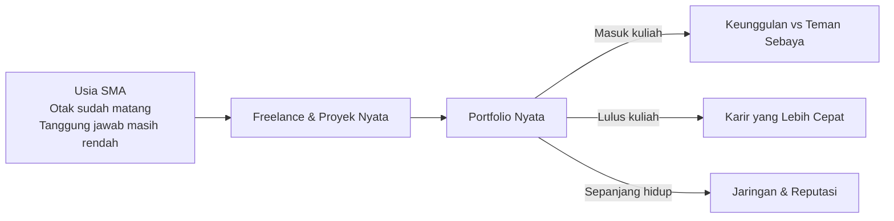

# Peta Karir — Dari Sekolah ke Dunia Nyata

Track ini berbeda dari semua track lainnya. Tidak ada kode, tidak ada rumus, tidak ada tools yang harus diinstall.

Ini adalah **peta berpikir** — tentang bagaimana kamu memposisikan diri di dunia yang jauh lebih kompleks dari yang diajarkan di kelas.

---

## Untuk Siapa Track Ini?

Kamu mungkin sedang membaca ini di salah satu dari tiga kondisi:

**Kelas X — "Masih belum terbayang"**
Baru masuk SMA. Dunia kerja terasa jauh. Kuliah saja masih 3 tahun lagi. Wajar kalau semua ini terasa abstrak. Tapi justru di sinilah letak keberuntunganmu — kamu punya waktu paling banyak. Setiap hal kecil yang kamu mulai sekarang akan berlipat ganda saat kamu lulus nanti.

**Kelas XI — "Sibuk dengan hal lain"**
Tahun paling "bebas" di SMA. Sudah tidak canggung seperti kelas X, belum panik seperti kelas XII. Banyak yang menghabiskan tahun ini untuk hal-hal yang tidak akan diingat 5 tahun ke depan. Tidak ada yang salah dengan bersenang-senang — tapi ada perbedaan besar antara istirahat yang disengaja dan waktu yang terbuang tanpa sadar.

**Kelas XII — "Baru menyadari"**
Tiba-tiba semua terasa mendesak. SNBP, UTBK, pilihan jurusan, ekspektasi orang tua, teman-teman yang sudah punya rencana. Kalau kamu baru menyadari pentingnya semua ini sekarang — itu masih jauh lebih baik dari tidak pernah menyadari sama sekali. Dan kabar baiknya: banyak yang bisa dilakukan bahkan dalam waktu yang tersisa.

---

## Premis Utama

Lingkungan akademis adalah ruang eksplorasi dan inkubasi yang luar biasa. Tapi tidak ada ruang yang lebih baik untuk **implementasi** selain kehidupan nyata dan pekerjaan nyata sehari-hari.

Kamu sudah cukup umur untuk mulai. Jangan tunggu lulus. Jangan tunggu "siap".

---

## Tentang Hidup yang Tidak Dirancang

Ada dua jenis orang yang akan kamu temui 10 tahun dari sekarang.

Yang pertama adalah orang yang di usia SMA-nya mulai memikirkan ke mana hidupnya akan pergi. Tidak harus sempurna, tidak harus tahu semua jawabannya — tapi mereka mulai bertanya, mulai mencoba, mulai membangun sesuatu. Mereka tidak selalu berhasil di percobaan pertama. Tapi setiap kegagalan mengajarkan sesuatu yang tidak bisa didapat dari buku.

Yang kedua adalah orang yang menghabiskan masa SMA-nya mengalir begitu saja. Ikut arus. Tidak banyak bertanya. Tidak banyak mencoba. Hidup terasa baik-baik saja — sampai tiba-tiba mereka berusia 25, 30, dan menyadari bahwa mereka tidak tahu siapa diri mereka, apa yang mereka mau, dan ke mana mereka pergi.

**Hidup memang bukan perlombaan.** Tidak ada yang harus "menang" lebih cepat dari orang lain. Tapi hidup yang tidak pernah dirancang — yang hanya mengalir tanpa arah — adalah petaka yang baru terasa dampaknya bertahun-tahun kemudian, ketika sudah terlambat untuk mudah diubah.

Track ini bukan tentang menjadi yang terbaik. Ini tentang menjadi versi terbaik dari dirimu sendiri — dengan sengaja, bukan kebetulan.

---

## Mengapa Mulai Sekarang?

Teman-temanmu yang mulai di usia 22 (setelah lulus kuliah) akan menghabiskan 2-3 tahun pertama untuk belajar hal-hal yang bisa kamu pelajari sekarang — dengan risiko yang jauh lebih rendah.

---

## Apa yang Akan Kamu Pelajari

1. **Mindset Dasar** — cara berpikir yang membedakan orang yang berkembang dari yang stagnan
2. **Identitas Digital** — membangun reputasi online yang bekerja untukmu 24/7
3. **Freelance Pertama** — dari nol hingga klien pertama, tanpa pengalaman
4. **Ekosistem Industri** — memahami rantai pasok nyata: dari pertanian hingga tech
5. **Navigasi Karir** — membuat keputusan karir yang tidak menyesal

---

## Satu Hal yang Perlu Kamu Terima Sekarang

> Dunia tidak peduli dengan nilai rapormu. Dunia peduli dengan apa yang bisa kamu **lakukan** dan **buktikan**.

Ijazah membuka pintu. Portfolio menentukan apakah kamu masuk atau tidak.

---

## Prasyarat

Tidak ada prasyarat teknis. Yang dibutuhkan hanya satu: **kemauan untuk tidak nyaman**.

Semua pelajaran di track ini akan terasa tidak nyaman pada awalnya. Itu tanda kamu sedang tumbuh.
