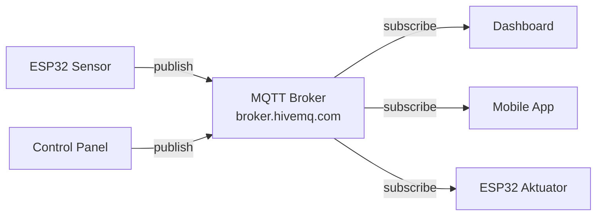

# ESP32 & MQTT — IoT Terhubung

ESP32 adalah mikrokontroler dengan WiFi dan Bluetooth built-in — sempurna untuk proyek IoT.

## ESP32 vs Arduino Uno

| | Arduino Uno | ESP32 |
|--|-------------|-------|
| CPU | 16 MHz | 240 MHz (dual core) |
| RAM | 2 KB | 520 KB |
| Flash | 32 KB | 4 MB |
| WiFi | ❌ | ✅ |
| Bluetooth | ❌ | ✅ |
| Harga | ~Rp 50rb | ~Rp 60rb |

## Koneksi WiFi

```cpp
#include <WiFi.h>

const char* ssid = "NamaWiFi";
const char* password = "PasswordWiFi";

void setup() {
  Serial.begin(115200);

  WiFi.begin(ssid, password);
  Serial.print("Menghubungkan ke WiFi");

  while (WiFi.status() != WL_CONNECTED) {
    delay(500);
    Serial.print(".");
  }

  Serial.println("\nTerhubung!");
  Serial.print("IP: ");
  Serial.println(WiFi.localIP());
}
```

## MQTT — Protokol IoT

MQTT (Message Queuing Telemetry Transport) adalah protokol publish-subscribe ringan untuk IoT.



```cpp
#include <WiFi.h>
#include <PubSubClient.h>
#include <DHT.h>

const char* mqtt_server = "broker.hivemq.com";
const char* topic_suhu = "smauii/lab/suhu";
const char* topic_led = "smauii/lab/led";

WiFiClient espClient;
PubSubClient client(espClient);
DHT dht(4, DHT11);

void callback(char* topic, byte* payload, unsigned int length) {
  String msg = "";
  for (int i = 0; i < length; i++) msg += (char)payload[i];

  if (String(topic) == topic_led) {
    digitalWrite(2, msg == "ON" ? HIGH : LOW);
    Serial.println("LED: " + msg);
  }
}

void reconnect() {
  while (!client.connected()) {
    if (client.connect("ESP32-SMAUII")) {
      client.subscribe(topic_led);
    } else {
      delay(5000);
    }
  }
}

void setup() {
  Serial.begin(115200);
  pinMode(2, OUTPUT);
  dht.begin();

  WiFi.begin("ssid", "password");
  while (WiFi.status() != WL_CONNECTED) delay(500);

  client.setServer(mqtt_server, 1883);
  client.setCallback(callback);
}

void loop() {
  if (!client.connected()) reconnect();
  client.loop();

  static unsigned long lastMsg = 0;
  if (millis() - lastMsg > 5000) {
    lastMsg = millis();

    float suhu = dht.readTemperature();
    if (!isnan(suhu)) {
      client.publish(topic_suhu, String(suhu).c_str());
      Serial.println("Published suhu: " + String(suhu));
    }
  }
}
```

## Dashboard dengan Node-RED

```bash
# Install Node-RED
npm install -g node-red
node-red

# Buka http://localhost:1880
# Drag: MQTT in → Function → Dashboard gauge
```

## HTTP REST API dari ESP32

```cpp
#include <HTTPClient.h>
#include <ArduinoJson.h>

void kirimData(float suhu, float kelembaban) {
  HTTPClient http;
  http.begin("https://api.smauiilab.sch.id/iot/data");
  http.addHeader("Content-Type", "application/json");
  http.addHeader("Authorization", "Bearer " + String(API_KEY));

  StaticJsonDocument<200> doc;
  doc["suhu"] = suhu;
  doc["kelembaban"] = kelembaban;
  doc["device_id"] = "esp32-lab-01";

  String body;
  serializeJson(doc, body);

  int httpCode = http.POST(body);
  Serial.println("HTTP Code: " + String(httpCode));
  http.end();
}
```

## Latihan

1. Hubungkan ESP32 + DHT11 ke broker MQTT publik
2. Subscribe dari laptop menggunakan MQTT Explorer
3. Buat dashboard Node-RED dengan gauge suhu real-time
4. Tambah kontrol LED via MQTT dari dashboard
