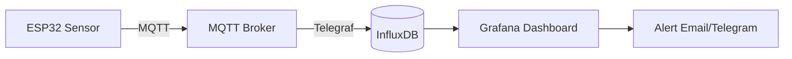

# Monitoring IoT dengan Grafana

Grafana adalah platform visualisasi open source yang sempurna untuk monitoring data sensor real-time.

## Stack Monitoring IoT



## Setup dengan Docker Compose

```yaml
# docker-compose.yml
version: "3.8"
services:
  mosquitto:
    image: eclipse-mosquitto:2
    ports:
      - "1883:1883"
    volumes:
      - ./mosquitto.conf:/mosquitto/config/mosquitto.conf

  influxdb:
    image: influxdb:2.7
    ports:
      - "8086:8086"
    environment:
      DOCKER_INFLUXDB_INIT_MODE: setup
      DOCKER_INFLUXDB_INIT_USERNAME: admin
      DOCKER_INFLUXDB_INIT_PASSWORD: password123
      DOCKER_INFLUXDB_INIT_ORG: smauii
      DOCKER_INFLUXDB_INIT_BUCKET: iot_data
    volumes:
      - influxdb_data:/var/lib/influxdb2

  telegraf:
    image: telegraf:1.29
    volumes:
      - ./telegraf.conf:/etc/telegraf/telegraf.conf
    depends_on:
      - mosquitto
      - influxdb

  grafana:
    image: grafana/grafana:10
    ports:
      - "3000:3000"
    environment:
      GF_SECURITY_ADMIN_PASSWORD: admin
    volumes:
      - grafana_data:/var/lib/grafana
    depends_on:
      - influxdb

volumes:
  influxdb_data:
  grafana_data:
```

## Konfigurasi Telegraf

```toml
# telegraf.conf
[[inputs.mqtt_consumer]]
  servers = ["tcp://mosquitto:1883"]
  topics = ["smauii/lab/#"]
  data_format = "json"

[[outputs.influxdb_v2]]
  urls = ["http://influxdb:8086"]
  token = "your-token"
  organization = "smauii"
  bucket = "iot_data"
```

## ESP32 Kirim Data ke InfluxDB

```cpp
#include <WiFi.h>
#include <InfluxDbClient.h>
#include <DHT.h>

InfluxDBClient client(
  "http://192.168.1.100:8086",
  "smauii",
  "iot_data",
  "your-token"
);

DHT dht(4, DHT11);
Point sensor("environment");

void setup() {
  WiFi.begin("ssid", "password");
  while (WiFi.status() != WL_CONNECTED) delay(500);
  dht.begin();

  sensor.addTag("device", "esp32-lab-01");
  sensor.addTag("location", "lab-komputer");
}

void loop() {
  sensor.clearFields();
  sensor.addField("temperature", dht.readTemperature());
  sensor.addField("humidity", dht.readHumidity());
  sensor.addField("wifi_rssi", WiFi.RSSI());

  if (!client.writePoint(sensor)) {
    Serial.println("Write failed: " + client.getLastErrorMessage());
  }

  delay(10000);  // Kirim setiap 10 detik
}
```

## Grafana Dashboard

1. Buka `http://localhost:3000`
2. Add data source → InfluxDB
3. Buat panel baru:

```flux
// Query Flux untuk suhu 1 jam terakhir
from(bucket: "iot_data")
  |> range(start: -1h)
  |> filter(fn: (r) => r._measurement == "environment")
  |> filter(fn: (r) => r._field == "temperature")
  |> aggregateWindow(every: 1m, fn: mean)
```

## Alert Telegram

```python
# Grafana webhook → Python script → Telegram
import requests
from flask import Flask, request

app = Flask(__name__)
BOT_TOKEN = "your-bot-token"
CHAT_ID = "your-chat-id"

@app.route("/alert", methods=["POST"])
def handle_alert():
    data = request.json
    message = f"🚨 Alert: {data['title']}\n{data['message']}"
    requests.post(
        f"https://api.telegram.org/bot{BOT_TOKEN}/sendMessage",
        json={"chat_id": CHAT_ID, "text": message}
    )
    return "OK"
```

## Latihan

1. Setup stack dengan Docker Compose
2. Hubungkan ESP32 + DHT11 ke InfluxDB
3. Buat dashboard Grafana dengan:
   - Gauge suhu real-time
   - Time series 24 jam
   - Alert jika suhu > 35°C
4. Kirim notifikasi ke Telegram saat alert
