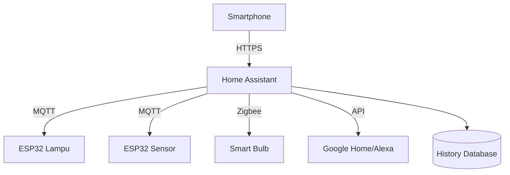

# Smart Home dengan ESP32

Bangun sistem smart home sendiri — lebih murah, lebih privat, dan lebih customizable dari produk komersial.

## Arsitektur Smart Home



## Home Assistant

Home Assistant adalah platform smart home open source yang berjalan di Raspberry Pi atau VPS.

```bash
# Install di Docker
docker run -d \
  --name homeassistant \
  --privileged \
  -p 8123:8123 \
  -v ~/homeassistant:/config \
  --restart unless-stopped \
  ghcr.io/home-assistant/home-assistant:stable

# Buka http://localhost:8123
```

## ESP32 + ESPHome

ESPHome memudahkan integrasi ESP32 dengan Home Assistant:

```yaml
# esphome/lampu-kamar.yaml
esphome:
  name: lampu-kamar
  platform: ESP32
  board: esp32dev

wifi:
  ssid: !secret wifi_ssid
  password: !secret wifi_password

api:
  encryption:
    key: !secret api_key

ota:
  password: !secret ota_password

logger:

light:
  - platform: monochromatic
    name: "Lampu Kamar"
    output: pwm_output
    id: lampu

output:
  - platform: ledc
    pin: GPIO16
    id: pwm_output

binary_sensor:
  - platform: gpio
    pin: GPIO4
    name: "Tombol Lampu"
    on_press:
      - light.toggle: lampu
```

```bash
# Flash ESP32
pip install esphome
esphome run lampu-kamar.yaml
```

## Sensor Ruangan Lengkap

```yaml
# esphome/sensor-ruangan.yaml
sensor:
  - platform: dht
    pin: GPIO4
    temperature:
      name: "Suhu Ruangan"
      unit_of_measurement: "°C"
    humidity:
      name: "Kelembaban Ruangan"
    update_interval: 60s

  - platform: adc
    pin: A0
    name: "Kualitas Udara (CO2)"
    unit_of_measurement: "ppm"

  - platform: bh1750
    name: "Intensitas Cahaya"
    address: 0x23

binary_sensor:
  - platform: pir
    pin: GPIO5
    name: "Gerak Terdeteksi"
    on_state:
      - if:
          condition:
            binary_sensor.is_on: gerak
          then:
            - light.turn_on: lampu
          else:
            - delay: 5min
            - light.turn_off: lampu
```

## Otomasi di Home Assistant

```yaml
# automations.yaml
- alias: "Lampu mati saat pergi"
  trigger:
    - platform: state
      entity_id: device_tracker.hp_sandi
      to: "not_home"
  action:
    - service: light.turn_off
      target:
        area_id: seluruh_rumah

- alias: "AC nyala jika panas"
  trigger:
    - platform: numeric_state
      entity_id: sensor.suhu_ruangan
      above: 30
  condition:
    - condition: time
      after: "08:00:00"
      before: "22:00:00"
  action:
    - service: switch.turn_on
      entity_id: switch.ac_kamar
    - service: notify.telegram
      data:
        message: "🌡️ Suhu {{ states('sensor.suhu_ruangan') }}°C — AC dinyalakan"
```

## Latihan

1. Setup Home Assistant di Docker
2. Buat sensor suhu/kelembaban dengan ESPHome
3. Buat dashboard monitoring rumah
4. Tambah otomasi: lampu otomatis berdasarkan waktu atau gerak
