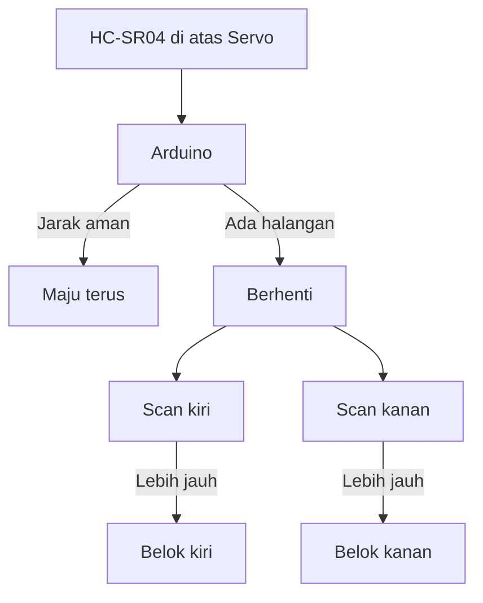

# Robot Obstacle Avoidance

Robot yang bisa menghindari rintangan secara otomatis menggunakan sensor ultrasonik dan servo.

## Komponen

| Komponen | Jumlah |
|----------|--------|
| Arduino Uno | 1 |
| Motor DC + roda | 2 |
| Driver L298N | 1 |
| Sensor HC-SR04 | 1 |
| Servo SG90 | 1 |
| Chassis robot | 1 |
| Baterai 9V | 1 |

## Arsitektur Sistem



## Kode Lengkap

```cpp
#include <Servo.h>
#include <NewPing.h>

// Motor pins
#define IN1 5
#define IN2 6
#define IN3 9
#define IN4 10
#define ENA 3
#define ENB 11

// Sensor pins
#define TRIG 12
#define ECHO 13
#define SERVO_PIN 7

#define SPEED 160
#define SAFE_DISTANCE 20  // cm

Servo scanServo;
NewPing sonar(TRIG, ECHO, 200);

void setup() {
  pinMode(IN1, OUTPUT); pinMode(IN2, OUTPUT);
  pinMode(IN3, OUTPUT); pinMode(IN4, OUTPUT);
  pinMode(ENA, OUTPUT); pinMode(ENB, OUTPUT);

  scanServo.attach(SERVO_PIN);
  scanServo.write(90);  // Hadap depan
  delay(500);

  Serial.begin(9600);
}

int bacaJarak() {
  delay(50);
  return sonar.ping_cm();
}

void maju() {
  digitalWrite(IN1, HIGH); digitalWrite(IN2, LOW);
  digitalWrite(IN3, HIGH); digitalWrite(IN4, LOW);
  analogWrite(ENA, SPEED); analogWrite(ENB, SPEED);
}

void mundur() {
  digitalWrite(IN1, LOW); digitalWrite(IN2, HIGH);
  digitalWrite(IN3, LOW); digitalWrite(IN4, HIGH);
  analogWrite(ENA, SPEED); analogWrite(ENB, SPEED);
}

void belokKiri() {
  digitalWrite(IN1, LOW);  digitalWrite(IN2, HIGH);
  digitalWrite(IN3, HIGH); digitalWrite(IN4, LOW);
  analogWrite(ENA, SPEED); analogWrite(ENB, SPEED);
  delay(400);
}

void belokKanan() {
  digitalWrite(IN1, HIGH); digitalWrite(IN2, LOW);
  digitalWrite(IN3, LOW);  digitalWrite(IN4, HIGH);
  analogWrite(ENA, SPEED); analogWrite(ENB, SPEED);
  delay(400);
}

void berhenti() {
  digitalWrite(IN1, LOW); digitalWrite(IN2, LOW);
  digitalWrite(IN3, LOW); digitalWrite(IN4, LOW);
}

void loop() {
  int jarakDepan = bacaJarak();
  Serial.print("Depan: "); Serial.println(jarakDepan);

  if (jarakDepan == 0 || jarakDepan > SAFE_DISTANCE) {
    maju();
  } else {
    berhenti();
    mundur();
    delay(300);
    berhenti();

    // Scan kiri dan kanan
    scanServo.write(0);   // Kiri
    delay(500);
    int jarakKiri = bacaJarak();

    scanServo.write(180); // Kanan
    delay(500);
    int jarakKanan = bacaJarak();

    scanServo.write(90);  // Kembali depan
    delay(300);

    Serial.print("Kiri: "); Serial.print(jarakKiri);
    Serial.print(" | Kanan: "); Serial.println(jarakKanan);

    if (jarakKiri > jarakKanan) {
      belokKiri();
    } else {
      belokKanan();
    }
  }
}
```

## Peningkatan: Multiple Sensors

```cpp
// 3 sensor: kiri, depan, kanan
NewPing sonarKiri(TRIG_L, ECHO_L, 200);
NewPing sonarDepan(TRIG_F, ECHO_F, 200);
NewPing sonarKanan(TRIG_R, ECHO_R, 200);

void loop() {
  int kiri = sonarKiri.ping_cm();
  int depan = sonarDepan.ping_cm();
  int kanan = sonarKanan.ping_cm();

  if (depan > SAFE_DISTANCE) {
    maju();
  } else if (kiri > kanan) {
    belokKiri();
  } else {
    belokKanan();
  }
}
```

## Latihan

1. Rakit robot dengan 1 sensor ultrasonik + servo
2. Test di ruangan dengan berbagai rintangan
3. Upgrade ke 3 sensor tanpa servo
4. Tambah logging ke Serial Plotter untuk analisis
