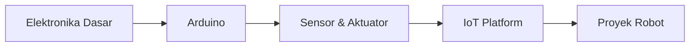

# Robotika & IoT

Track ini mempersiapkan kamu untuk membangun sistem fisik yang cerdas — dari LED berkedip hingga robot yang bisa bernavigasi sendiri.

## Roadmap

## Modul

1. **Elektronika Dasar** — Tegangan, arus, resistor, LED, breadboard
2. **Arduino** — Setup, sketch, digital/analog I/O
3. **Sensor & Aktuator** — Ultrasonic, DHT11, servo, motor DC
4. **IoT Platform** — MQTT, ESP32, cloud dashboard
5. **Proyek Robot** — Line follower, obstacle avoidance

## Yang Kamu Butuhkan

- Arduino Uno atau ESP32
- Breadboard + kabel jumper
- Komponen dasar (LED, resistor, sensor)
- Laptop dengan Arduino IDE

## Prasyarat

Tidak ada prasyarat. Rasa ingin tahu dan tidak takut menyolder sudah cukup.
