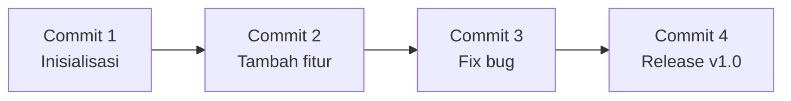

# Apa itu Git?

Git adalah sistem **version control** — alat untuk melacak perubahan kode dari waktu ke waktu.

## Mengapa Git Penting?

Bayangkan kamu mengerjakan proyek dan membuat kesalahan. Tanpa Git, kamu harus ingat semua perubahan yang kamu buat. Dengan Git, kamu bisa kembali ke versi sebelumnya kapan saja.



## Konsep Dasar

### Repository (Repo)
Folder proyek yang dilacak oleh Git.

```bash
# Inisialisasi repo baru
git init

# Clone repo yang sudah ada
git clone https://github.com/user/repo.git
```

### Commit
Snapshot dari perubahan kode pada satu waktu.

```bash
# Lihat status perubahan
git status

# Tambahkan file ke staging
git add nama-file.txt
git add .  # semua file

# Buat commit
git commit -m "feat: tambah halaman login"
```

### Branch
Cabang pengembangan yang terpisah dari main.

```bash
# Buat branch baru
git branch nama-fitur

# Pindah ke branch
git checkout nama-fitur

# Shortcut: buat + pindah sekaligus
git checkout -b nama-fitur
```

## Konvensi Commit Message

Gunakan format **Conventional Commits**:

```
<type>: <deskripsi singkat>

type:
  feat     → fitur baru
  fix      → perbaikan bug
  docs     → perubahan dokumentasi
  refactor → refactor kode
  chore    → maintenance
```

**Contoh:**
```
feat: tambah halaman profil pengguna
fix: perbaiki bug login dengan email
docs: update README dengan instruksi setup
```

## Latihan

1. Buat folder baru dan inisialisasi Git
2. Buat file `README.md` dengan isi bebas
3. Buat commit pertama dengan pesan yang sesuai konvensi
4. Buat branch baru bernama `feat/tambah-konten`
5. Tambahkan file baru di branch tersebut
6. Commit perubahan

## Matematika di Balik Hashing Git

Git menggunakan SHA-1 untuk mengidentifikasi setiap commit:

$$\text{hash} = \text{SHA-1}(\text{content} + \text{metadata})$$

Setiap commit ID adalah hash 40 karakter hexadecimal yang unik, misalnya:
`a1b2c3d4e5f6...`

---

> 💡 **Tips:** Commit sering dengan pesan yang jelas. Lebih baik banyak commit kecil daripada satu commit besar yang susah di-review.
