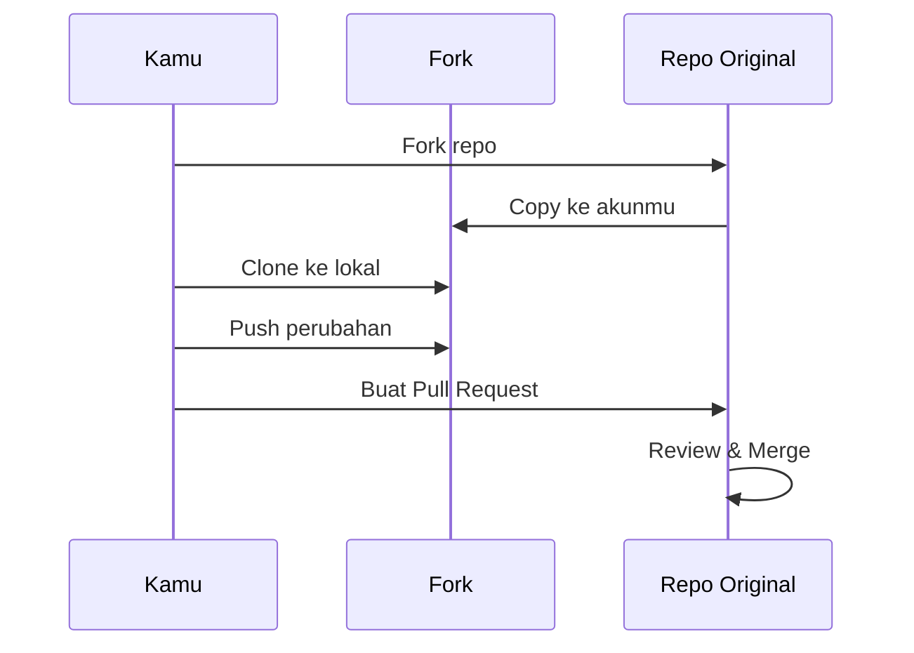

# GitHub & Kolaborasi

GitHub adalah platform hosting untuk Git repository, sekaligus tempat kolaborasi developer seluruh dunia.

## Alur Kolaborasi



## Fork vs Clone

| | Fork | Clone |
|---|---|---|
| **Tujuan** | Kontribusi ke repo orang lain | Kerja di repo sendiri |
| **Lokasi copy** | Di akun GitHub kamu | Di komputer lokal |
| **Hubungan** | Terhubung ke repo original | Terhubung ke remote |

## Pull Request (PR)

PR adalah cara mengusulkan perubahan ke repo orang lain.

**Langkah membuat PR:**

```bash
# 1. Fork repo di GitHub (via web)

# 2. Clone fork kamu
git clone git@github.com:username-kamu/repo.git

# 3. Buat branch untuk fitur
git checkout -b feat/nama-fitur

# 4. Buat perubahan, commit
git add .
git commit -m "feat: deskripsi perubahan"

# 5. Push ke fork kamu
git push origin feat/nama-fitur

# 6. Buka GitHub → buat Pull Request
```

## Latihan

1. Fork repo [smauii-dev-content](https://github.com/SMA-UII-Yogyakarta/smauii-dev-content)
2. Clone fork ke lokal
3. Buat branch `feat/perbaikan-typo`
4. Perbaiki typo di salah satu file
5. Push dan buat Pull Request

---

> 🎯 **Challenge:** Cari proyek open source yang kamu suka di GitHub dan buat kontribusi pertamamu — sekecil apapun, mulai dari perbaikan typo di dokumentasi.
