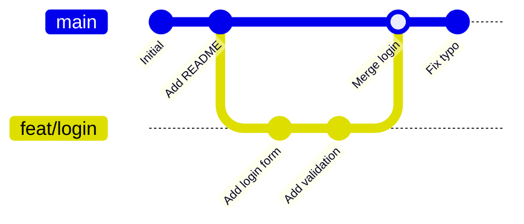
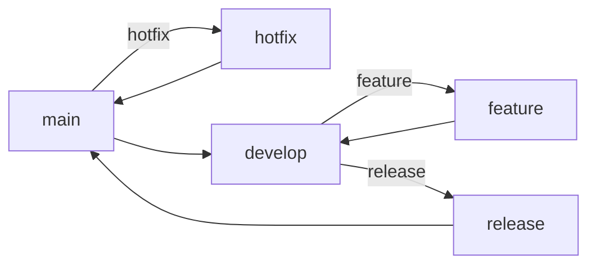

# Git Branching & Workflow

Branch memungkinkan kamu bekerja pada fitur baru tanpa mengganggu kode yang sudah stabil.

## Konsep Branch



## Perintah Branch

```bash
# Lihat semua branch
git branch
git branch -a  # termasuk remote

# Buat branch baru
git branch feat/fitur-baru

# Pindah ke branch
git checkout feat/fitur-baru

# Buat + pindah sekaligus (shortcut)
git checkout -b feat/fitur-baru

# Hapus branch (setelah merge)
git branch -d feat/fitur-baru
```

## Merge vs Rebase

### Merge — Gabungkan dengan commit baru

```bash
git checkout main
git merge feat/fitur-baru
```

```
main:    A---B---C---M
                    /
feat:        D---E
```

### Rebase — Tempel di atas branch target

```bash
git checkout feat/fitur-baru
git rebase main
```

```
main:    A---B---C
                  \
feat:              D'---E'
```

> **Aturan:** Jangan rebase branch yang sudah di-push ke remote dan dipakai orang lain.

## Git Flow — Workflow Tim



**Branch utama:**
- `main` — kode production, selalu stabil
- `develop` — integrasi fitur

**Branch sementara:**
- `feat/nama` — fitur baru
- `fix/nama` — bug fix
- `hotfix/nama` — fix darurat di production

## Resolve Conflict

```bash
# Saat merge conflict:
git merge feat/fitur-baru
# CONFLICT (content): Merge conflict in src/app.js

# Buka file, cari marker:
<<<<<<< HEAD
const x = 1;  # versi kamu
=======
const x = 2;  # versi mereka
>>>>>>> feat/fitur-baru

# Edit file, hapus marker, simpan
# Lalu:
git add src/app.js
git commit -m "resolve merge conflict"
```

## Latihan

1. Buat repo baru di GitHub
2. Buat branch `feat/halaman-about`
3. Tambah file `about.html`
4. Merge ke `main` via Pull Request di GitHub
