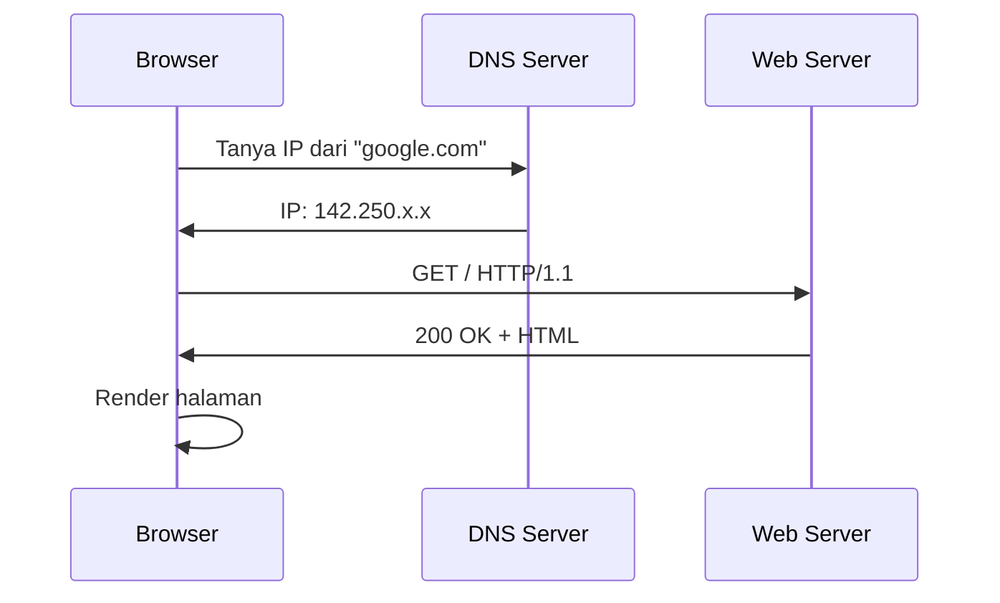
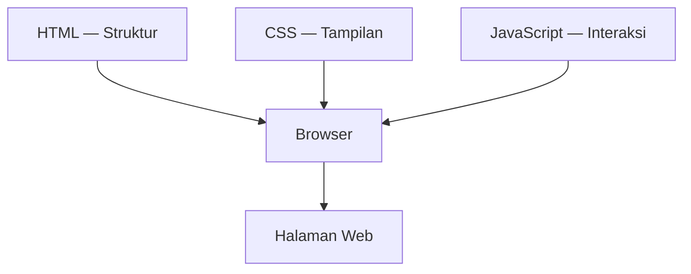

# Cara Kerja Web

Setiap kali kamu membuka browser dan mengetik URL, ada proses panjang yang terjadi di balik layar.

## Alur Request-Response



## Komponen Utama

### 1. URL

```
https://lab.smauiiyk.sch.id/learn?track=se#modul-1
│       │                    │     │        │
│       host                 path  query    fragment
protocol
```

### 2. HTTP Methods

| Method | Kegunaan |
|--------|----------|
| GET | Ambil data |
| POST | Kirim data baru |
| PUT/PATCH | Update data |
| DELETE | Hapus data |

### 3. Status Code

- **2xx** — Sukses (200 OK, 201 Created)
- **3xx** — Redirect (301, 302)
- **4xx** — Error client (404 Not Found, 403 Forbidden)
- **5xx** — Error server (500 Internal Server Error)

## Tiga Pilar Web



## Latihan

1. Buka DevTools (F12) → tab Network
2. Refresh halaman ini
3. Amati request yang terjadi — berapa banyak? Status code apa saja?
