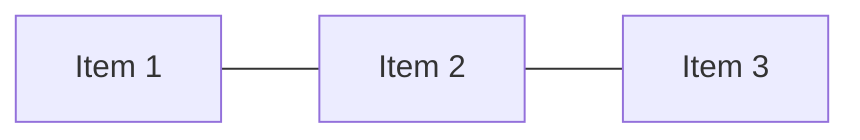

# CSS — Tampilan dan Layout

CSS (Cascading Style Sheets) mengontrol tampilan visual elemen HTML.

## Cara Menulis CSS

```css
/* Selector { property: value; } */
h1 {
  color: #3b82f6;
  font-size: 2rem;
  font-weight: bold;
}
```

### Tiga Cara Menambahkan CSS

```html
<!-- 1. Inline (hindari!) -->
<p style="color: red;">Teks merah</p>

<!-- 2. Internal -->
<style>
  p { color: blue; }
</style>

<!-- 3. External (rekomendasi) -->
<link rel="stylesheet" href="style.css">
```

## Box Model

Setiap elemen HTML adalah sebuah kotak:

```
┌─────────────────────────────┐
│           margin            │
│  ┌───────────────────────┐  │
│  │        border         │  │
│  │  ┌─────────────────┐  │  │
│  │  │     padding     │  │  │
│  │  │  ┌───────────┐  │  │  │
│  │  │  │  content  │  │  │  │
│  │  │  └───────────┘  │  │  │
│  │  └─────────────────┘  │  │
│  └───────────────────────┘  │
└─────────────────────────────┘
```

```css
.kotak {
  width: 200px;
  padding: 16px;
  border: 2px solid #333;
  margin: 24px;
}
```

## Flexbox — Layout 1 Dimensi

```css
.container {
  display: flex;
  justify-content: space-between; /* horizontal */
  align-items: center;            /* vertical */
  gap: 16px;
}
```



## Grid — Layout 2 Dimensi

```css
.grid {
  display: grid;
  grid-template-columns: repeat(3, 1fr);
  gap: 16px;
}
```

## Responsive Design

```css
/* Mobile first */
.card {
  width: 100%;
}

/* Tablet ke atas */
@media (min-width: 640px) {
  .card {
    width: 50%;
  }
}

/* Desktop */
@media (min-width: 1024px) {
  .card {
    width: 33.33%;
  }
}
```

## Latihan

Styling halaman HTML dari latihan sebelumnya:
1. Buat navbar horizontal dengan Flexbox
2. Buat grid 3 kolom untuk konten
3. Pastikan responsive di mobile (1 kolom) dan desktop (3 kolom)
