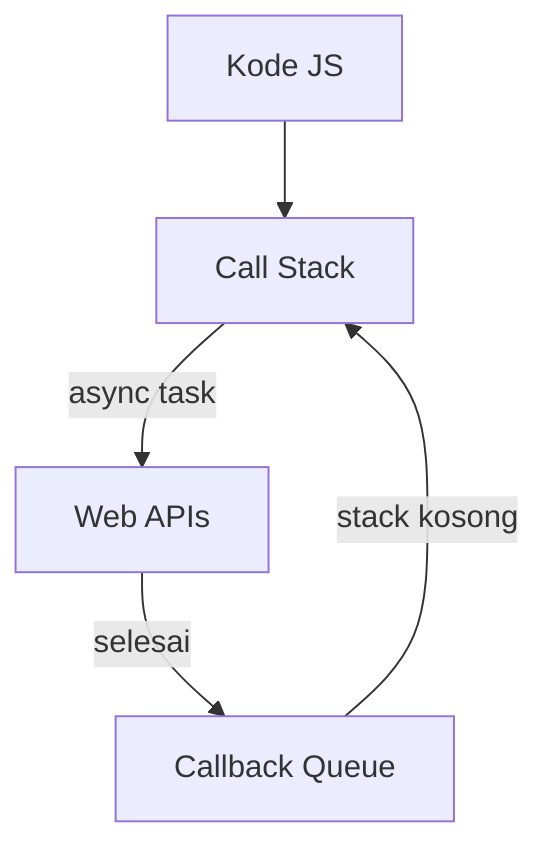

# JavaScript Async & Promise

JavaScript berjalan secara single-threaded, tapi bisa menangani operasi async (jaringan, file, timer) tanpa memblokir eksekusi.

## Event Loop



## Promise

Promise adalah objek yang merepresentasikan nilai yang mungkin tersedia sekarang, nanti, atau tidak pernah.

```javascript
// Membuat Promise
const janji = new Promise((resolve, reject) => {
  const berhasil = true;

  if (berhasil) {
    resolve("Data berhasil diambil");
  } else {
    reject(new Error("Gagal mengambil data"));
  }
});

// Menggunakan Promise
janji
  .then(data => console.log(data))
  .catch(err => console.error(err))
  .finally(() => console.log("Selesai"));
```

## Async/Await

Sintaks yang lebih bersih untuk Promise:

```javascript
// Tanpa async/await (callback hell)
fetch("/api/user")
  .then(res => res.json())
  .then(user => fetch(`/api/posts?userId=${user.id}`))
  .then(res => res.json())
  .then(posts => console.log(posts))
  .catch(err => console.error(err));

// Dengan async/await (lebih bersih)
const loadUserPosts = async () => {
  try {
    const userRes = await fetch("/api/user");
    const user = await userRes.json();

    const postsRes = await fetch(`/api/posts?userId=${user.id}`);
    const posts = await postsRes.json();

    console.log(posts);
  } catch (err) {
    console.error(err);
  }
};
```

## Promise.all — Paralel

```javascript
// Jalankan semua fetch secara bersamaan
const [user, posts, comments] = await Promise.all([
  fetch("/api/user").then(r => r.json()),
  fetch("/api/posts").then(r => r.json()),
  fetch("/api/comments").then(r => r.json()),
]);
```

> **Tips:** Gunakan `Promise.all` ketika request tidak saling bergantung — jauh lebih cepat dari sequential await.

## Error Handling

```javascript
const safeJson = async (url) => {
  const res = await fetch(url);

  if (!res.ok) {
    throw new Error(`HTTP ${res.status}: ${res.statusText}`);
  }

  return res.json();
};

try {
  const data = await safeJson("/api/data");
} catch (err) {
  if (err.message.includes("404")) {
    console.log("Data tidak ditemukan");
  } else {
    console.error("Error tidak terduga:", err);
  }
}
```

## Latihan

Buat fungsi `fetchGitHubProfile(username)` yang:
1. Fetch data user dari `https://api.github.com/users/{username}`
2. Fetch repos dari `https://api.github.com/users/{username}/repos`
3. Return objek `{ name, bio, repos: [...] }` menggunakan `Promise.all`
4. Handle error jika user tidak ditemukan (404)
