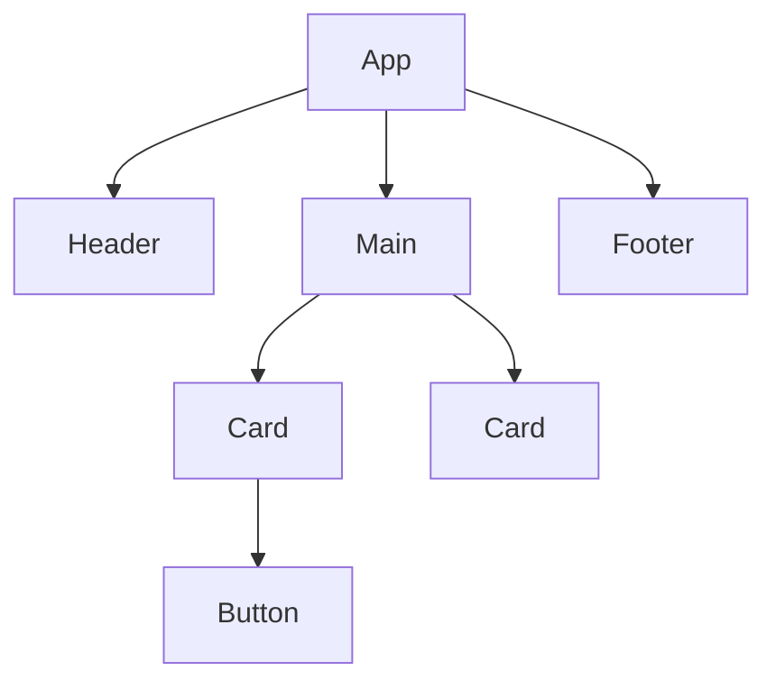

# Pengantar React

React adalah library JavaScript untuk membangun UI berbasis komponen. Dibuat oleh Meta, dipakai oleh hampir semua perusahaan teknologi besar.

## Konsep Inti



Setiap kotak adalah **komponen** — unit UI yang reusable.

## Komponen Pertama

```jsx
// Komponen = fungsi yang return JSX
function Salam({ nama }) {
  return (
    <div className="card">
      <h1>Halo, {nama}!</h1>
      <p>Selamat datang di React.</p>
    </div>
  );
}

// Penggunaan
<Salam nama="Sandi" />
```

## State dengan useState

```jsx
import { useState } from "react";

function Counter() {
  const [count, setCount] = useState(0);

  return (
    <div>
      <p>Count: {count}</p>
      <button onClick={() => setCount(count + 1)}>+</button>
      <button onClick={() => setCount(count - 1)}>-</button>
    </div>
  );
}
```

## Side Effects dengan useEffect

```jsx
import { useState, useEffect } from "react";

function GitHubProfile({ username }) {
  const [user, setUser] = useState(null);
  const [loading, setLoading] = useState(true);

  useEffect(() => {
    fetch(`https://api.github.com/users/${username}`)
      .then(r => r.json())
      .then(data => {
        setUser(data);
        setLoading(false);
      });
  }, [username]); // Re-run jika username berubah

  if (loading) return <p>Loading...</p>;

  return (
    <div>
      
      <h2>{user.name}</h2>
      <p>{user.bio}</p>
      <p>{user.public_repos} repos</p>
    </div>
  );
}
```

## List Rendering

```jsx
const tracks = ["Software Engineering", "AI", "Data Science"];

function TrackList() {
  return (
    <ul>
      {tracks.map((track, i) => (
        <li key={i}>{track}</li>
      ))}
    </ul>
  );
}
```

## Latihan

Buat komponen `MemberCard` yang menerima props `{ nama, kelas, tracks[] }` dan menampilkan kartu anggota dengan:
1. Avatar (inisial nama)
2. Nama dan kelas
3. Badge untuk setiap track
4. Tombol "Lihat Profil"
