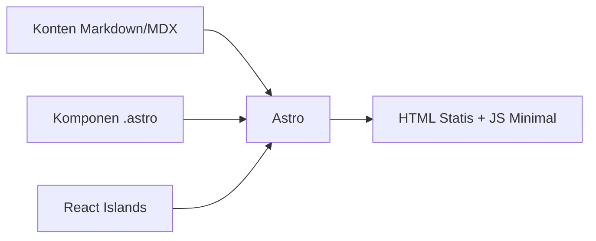

# Astro — Web Framework Modern

Astro adalah framework web yang menghasilkan HTML statis secepat mungkin, dengan JavaScript hanya di tempat yang diperlukan.

## Filosofi Astro



**Islands Architecture** — Hanya komponen interaktif yang di-hydrate di browser. Sisanya pure HTML.

## Struktur Proyek

```
src/
  pages/          ← Route otomatis dari nama file
    index.astro   → /
    about.astro   → /about
    blog/
      [slug].astro → /blog/:slug
  components/     ← Komponen reusable
  layouts/        ← Template halaman
  content/        ← Markdown/MDX content
  styles/
public/           ← File statis (gambar, font)
astro.config.mjs
```

## Komponen Astro

```astro
---
// Frontmatter — berjalan di server
import Layout from "@layouts/Layout.astro";
import { getCollection } from "astro:content";

const posts = await getCollection("blog");
const { title } = Astro.props;
---

<!-- Template — HTML + JSX-like syntax -->
<Layout title={title}>
  <h1>{title}</h1>
  <ul>
    {posts.map(post => (
      <li>
        <a href={`/blog/${post.slug}`}>{post.data.title}</a>
      </li>
    ))}
  </ul>
</Layout>

<style>
  /* Scoped CSS — hanya berlaku di komponen ini */
  h1 { color: blue; }
</style>
```

## Content Collections

```typescript
// src/content.config.ts
import { defineCollection, z } from "astro:content";
import { glob } from "astro/loaders";

const blog = defineCollection({
  loader: glob({ pattern: "**/*.md", base: "./src/content/blog" }),
  schema: z.object({
    title: z.string(),
    date: z.date(),
    tags: z.array(z.string()),
  }),
});

export const collections = { blog };
```

```astro
---
// Penggunaan di halaman
import { getCollection, getEntry } from "astro:content";

const posts = await getCollection("blog");
const post = await getEntry("blog", "hello-world");
const { Content } = await render(post);
---

<Content />
```

## React Island

```astro
---
import Counter from "@components/Counter.tsx";
---

<!-- Hydrate saat visible di viewport -->
<Counter client:visible initialCount={0} />

<!-- Hydrate segera saat halaman load -->
<Counter client:load />

<!-- Hydrate saat idle -->
<Counter client:idle />
```

## Latihan

1. Install Astro: `npm create astro@latest`
2. Buat halaman `/about` dengan data dirimu
3. Buat komponen `Card.astro` yang menerima props `title` dan `description`
4. Buat collection `projects` dengan schema: title, description, url, tags
