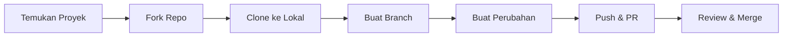

# Cara Berkontribusi ke Open Source

Open source bukan hanya tentang kode — dokumentasi, bug report, dan review juga kontribusi yang berharga.

## Alur Kontribusi



## Langkah Detail

### 1. Fork & Clone

```bash
# Fork via GitHub UI, lalu:
git clone https://github.com/USERNAME/REPO.git
cd REPO

# Tambahkan upstream (repo asli)
git remote add upstream https://github.com/ORIGINAL/REPO.git
```

### 2. Buat Branch

```bash
# Selalu buat branch baru, jangan langsung di main
git checkout -b feat/tambah-fitur-x

# Atau untuk bug fix
git checkout -b fix/perbaiki-bug-y
```

### 3. Commit yang Baik

```bash
# Conventional commits
git commit -m "feat: tambah komponen MemberCard"
git commit -m "fix: perbaiki validasi email di form registrasi"
git commit -m "docs: update README dengan instruksi instalasi"
git commit -m "refactor: pisahkan logika auth ke lib/auth.ts"
```

Format: `type(scope): deskripsi singkat`

Types: `feat`, `fix`, `docs`, `style`, `refactor`, `test`, `chore`

### 4. Sync dengan Upstream

```bash
# Sebelum push, sync dulu
git fetch upstream
git rebase upstream/main

# Resolve konflik jika ada, lalu:
git push origin feat/tambah-fitur-x
```

### 5. Pull Request yang Baik

PR yang baik memiliki:
- **Judul** yang jelas dan singkat
- **Deskripsi** yang menjelaskan apa yang diubah dan mengapa
- **Screenshot** jika ada perubahan UI
- **Test** yang membuktikan perubahan bekerja
- **Referensi issue** jika ada (`Closes #123`)

## Menemukan Proyek untuk Dikontribusi

1. **GitHub Explore** — github.com/explore
2. **Good First Issues** — goodfirstissue.dev
3. **Up For Grabs** — up-for-grabs.net
4. **Proyek yang kamu pakai** — cek issues yang ada

## Kontribusi Non-Kode

- Perbaiki typo di dokumentasi
- Tambah contoh penggunaan
- Terjemahkan dokumentasi
- Report bug dengan detail yang lengkap
- Review PR orang lain

## Latihan

1. Fork repo `smauii-dev-content`
2. Tambah 1 lesson baru di track pilihanmu
3. Buat PR dengan deskripsi yang lengkap
