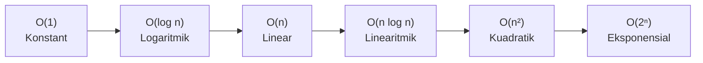

# Kompleksitas Waktu & Ruang

Di KSN Informatika, kamu tidak hanya dinilai dari apakah program kamu menghasilkan jawaban yang benar — tapi juga **seberapa cepat** program itu berjalan. Soal KSN biasanya punya batasan waktu 1–2 detik dan input bisa mencapai $10^6$ elemen. Program yang benar tapi lambat akan mendapat nilai 0.

Di sinilah **analisis kompleksitas** menjadi krusial.

## Apa itu Big-O Notation?

Big-O adalah cara untuk mengekspresikan **seberapa lambat algoritma tumbuh** seiring bertambahnya ukuran input $n$.

Kita tidak peduli dengan konstanta kecil — yang penting adalah pola pertumbuhannya:



Dari kiri ke kanan: semakin lambat.

## Kompleksitas yang Umum di KSN

| Notasi | Nama | Contoh | Batas n yang aman |
|--------|------|--------|-------------------|
| $O(1)$ | Konstant | Akses array by index | Berapapun |
| $O(\log n)$ | Logaritmik | Binary search | $10^{18}$ |
| $O(n)$ | Linear | Loop sekali | $10^8$ |
| $O(n \log n)$ | Linearitmik | Merge sort | $10^6$ |
| $O(n^2)$ | Kuadratik | Nested loop | $10^4$ |
| $O(n^3)$ | Kubik | Triple nested loop | $500$ |
| $O(2^n)$ | Eksponensial | Brute force subset | $20$ |

> **Aturan praktis KSN:** Komputer modern bisa menjalankan sekitar $10^8$ operasi per detik. Jika batas waktu 1 detik dan $n = 10^5$, kamu butuh algoritma $O(n \log n)$ atau lebih baik.

## Cara Menghitung Kompleksitas

### Loop tunggal → O(n)

```cpp
for (int i = 0; i < n; i++) {
    // operasi O(1)
}
// Total: O(n)
```

### Nested loop → O(n²)

```cpp
for (int i = 0; i < n; i++) {
    for (int j = 0; j < n; j++) {
        // operasi O(1)
    }
}
// Total: O(n²)
```

### Loop yang membagi dua → O(log n)

```cpp
int x = n;
while (x > 1) {
    x /= 2;  // setiap iterasi, x dibagi 2
}
// Total: O(log n) — karena butuh log₂(n) langkah sampai x = 1
```

### Kombinasi → ambil yang dominan

```cpp
for (int i = 0; i < n; i++) { ... }        // O(n)
for (int i = 0; i < n; i++) {
    for (int j = 0; j < n; j++) { ... }    // O(n²)
}
// Total: O(n) + O(n²) = O(n²)  ← ambil yang terbesar
```

## Kompleksitas Ruang (Space Complexity)

Selain waktu, KSN juga punya batas memori (biasanya 256MB). Kompleksitas ruang mengukur berapa banyak memori yang digunakan.

```cpp
int arr[1000000];  // 4 bytes × 10⁶ = 4MB — aman
int mat[1000][1000];  // 4 bytes × 10⁶ = 4MB — aman
int mat[10000][10000];  // 4 bytes × 10⁸ = 400MB — MELEBIHI BATAS!
```

> **Tips:** Untuk array 2D berukuran $n \times n$, pastikan $n^2 \times 4 \text{ bytes} \leq 256\text{MB}$, artinya $n \leq 8000$.

## Contoh Analisis: Mencari Pasangan dengan Jumlah K

**Soal:** Diberikan array $A$ berisi $n$ bilangan bulat dan bilangan $K$. Apakah ada dua elemen di $A$ yang jumlahnya sama dengan $K$?

### Solusi Brute Force — O(n²)

```cpp
#include <bits/stdc++.h>
using namespace std;

bool hasPair(vector<int>& A, int K) {
    int n = A.size();
    for (int i = 0; i < n; i++) {
        for (int j = i + 1; j < n; j++) {
            if (A[i] + A[j] == K) return true;
        }
    }
    return false;
}
```

Untuk $n = 10^5$: $10^{10}$ operasi → **TLE (Time Limit Exceeded)**

### Solusi Efisien — O(n)

```cpp
bool hasPair(vector<int>& A, int K) {
    unordered_set<int> seen;
    for (int x : A) {
        if (seen.count(K - x)) return true;  // cek apakah pasangannya sudah ada
        seen.insert(x);
    }
    return false;
}
```

Untuk $n = 10^5$: $10^5$ operasi → **AC (Accepted)**

Kuncinya: gunakan hash set untuk lookup $O(1)$ alih-alih loop kedua.

## Rangkuman

- Big-O mengukur pertumbuhan waktu/ruang relatif terhadap ukuran input
- Di KSN, estimasi $10^8$ operasi/detik sebagai patokan
- Selalu analisis kompleksitas sebelum coding — jangan langsung brute force
- Kompleksitas ruang juga penting: jangan alokasi memori berlebihan

## Latihan

1. Tentukan kompleksitas waktu fungsi berikut:
   ```cpp
   void mystery(int n) {
       for (int i = 1; i <= n; i *= 2)
           for (int j = 0; j < i; j++)
               cout << j;
   }
   ```

2. [TLX] [Latihan Big-O](https://tlx.toki.or.id/courses/competitive/chapters/01/problems/A) — verifikasi pemahamanmu

3. Tulis dua versi fungsi untuk mencari nilai maksimum di array 2D berukuran $n \times m$: satu dengan kompleksitas $O(nm)$ dan satu dengan $O(n + m)$ (hint: tidak selalu mungkin — pikirkan kapan yang kedua bisa dilakukan).

## Referensi

- [CP-Algorithms: Complexity](https://cp-algorithms.com/algebra/big-o.html)
- [USACO Guide: Time Complexity](https://usaco.guide/bronze/time-comp)
- [TOKI Training Gate](https://training.toki.or.id)
