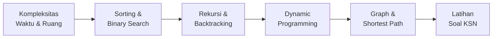

# Algoritma Kompetitif

Modul ini mempersiapkan kamu untuk **KSN (Kompetisi Sains Nasional) bidang Informatika** — kompetisi pemrograman bergengsi tingkat nasional yang diadakan Kemendikdasmen setiap tahun.

## Roadmap Modul

## Prasyarat

Sebelum mulai modul ini, pastikan kamu sudah memahami:
- Dasar pemrograman C++ (variabel, loop, fungsi, array)
- Konsep fungsi rekursif

Belum familiar dengan C++? Mulai dari modul [Software Engineering → JavaScript](../03-javascript/) dulu untuk membangun logika pemrograman, lalu pelajari C++ secara mandiri via [cppreference.com](https://en.cppreference.com).

## Lesson dalam Modul

1. **Kompleksitas Waktu & Ruang** — Big-O notation, analisis algoritma
2. **Sorting Lanjutan** — Merge sort, quick sort, kapan pakai yang mana
3. **Binary Search & Variasinya** — Pencarian efisien dan aplikasinya
4. **Rekursi & Backtracking** — Divide and conquer, pruning
5. **Dynamic Programming** — Memoization, tabulation, pola umum
6. **Graph Dasar** — Representasi, BFS, DFS
7. **Shortest Path** — Dijkstra, Floyd-Warshall
8. **Latihan Soal KSN** — Kumpulan soal dari TLX dengan pembahasan

## Tingkat Kesulitan per Tahap KSN

| Tahap | Materi yang Diuji |
|-------|------------------|
| KSN Sekolah | Sorting, searching, logika dasar |
| KSN Kabupaten | + Rekursi, DP dasar, graph sederhana |
| KSN Provinsi | + DP lanjutan, Dijkstra, matematika diskrit |
| KSN Nasional | + Segment tree, network flow, string algorithms |

## Referensi Utama

- [TLX TOKI](https://tlx.toki.or.id) — platform latihan resmi, soal KSN tersedia
- [TOKI Training Gate](https://training.toki.or.id) — kurikulum terstruktur gratis
- [CP-Algorithms](https://cp-algorithms.com) — referensi algoritma terlengkap
- [USACO Guide](https://usaco.guide) — kurikulum competitive programming internasional
