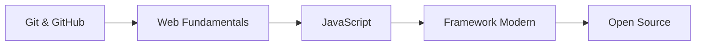

# Software Engineering

Track ini mempersiapkan kamu untuk menjadi software engineer yang bisa berkontribusi ke proyek nyata.

## Roadmap

## Modul

1. **Git & GitHub** — Version control, branching, pull request
2. **Web Fundamentals** — HTML, CSS, cara kerja browser
3. **JavaScript** — Dasar pemrograman, DOM, async
4. **Framework Modern** — React/Svelte/Astro
5. **Open Source** — Cara berkontribusi ke proyek dunia nyata

## Prasyarat

Tidak ada prasyarat khusus. Cukup semangat belajar dan laptop.
